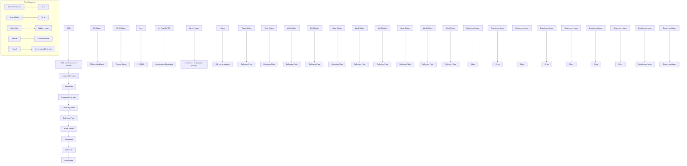

<!-- source: data\demo_docs\2409.18430_Energy_Levels_and_Transition_Rates_of_Laser-Cooling_Candidate_Th-.pdf -->

# Energy Levels and Transition Rates of Laser-Cooling Candidate Th $^{-}$

Rui Zhang, Yuzhu Lu, Shuaiting Yan, and Chuangang Ning $^{a)}$

Department of Physics, State Key Laboratory of Low Dimensional Quantum Physics, Frontier Science Center for Quantum Information, Tsinghua University, Beijing 100084, China

a) Author to whom correspondence should be addressed: ningcg@tsinghua.edu.cn

# ABSTRACT

The energy levels and transition rates of promising laser-cooling candidate thorium anion Th $^{-}$ have been experimentally obtained in the current work. Three new excited states between the bound-bound electric dipole (E1) transition $^{2}S_{1/2}^{o} \leftrightarrow ^{4}F_{3/2}^{e}$ of Th $^{-}$ are observed now: $^{4}G_{5/2}^{o}$ , $^{4}F_{9/2}^{e}$ and $^{4}F_{7/2}^{o}$ , and their energy levels are determined to be 1,847(13), 3,166.8(59) and 3,666(12) cm $^{-1}$ , respectively. Meanwhile, the lifetime of the upper state $^{2}S_{1/2}^{o}$ of that E1 transition is experimentally determined to be 30(2) μs, about 3 times shorter than the previous calculated result 86 μs, which makes Th $^{-}$ the most promising candidate for laser cooling of negative ions. Furthermore, the lifetimes of two other short-lived odd-parity excited states of Th $^{-}$ are also measured to be 59(4) and 53(3) μs, respectively.

# I. INTRODUCTION

Laser cooling [1,2], a crucial experimental technique for producing ultracold atoms and molecules, is opening up lots of brand-new research areas [3,4] and enabling experiments at unprecedentedly low temperatures [5,6]. Initially achieved in positive ions $Ba^{+}$ [7] and $Mg^{+}$ [8] in 1978, the technique was later extended to neutral atom Na [9]. However, this promising technology has remained confined to neutral and positive ions systems, with no realization in any negative ions over the past half-century. The primary obstacle is the lack of a closed and fast electric-dipole (E1) cycling transition between two bound states within the anionic candidate systems for the laser cooling. In contrast to positive ions and neutral systems, which typically have nearly infinite bound states, negative ions possess their extra electrons by the short-range polarization or electron correlation effects [10]. As a result, anions are generally characterized by having no excited bound states, possessing only one ground state [11-14]. Negative ions with excited bound states are very rare, and the presence of E1 cycling transitions between these states is even more uncommon. The molecular anion $C_{2}^{-}$ has been proposed as a candidate for laser cooling [15-17]. However, molecular cooling requires the recycling of vibrational and rotational branching during the cycling transition, complicating the laser systems involved.

Only four atomic anions (Os $^{-}$ [18-23], Ce $^{-}$ [24,25], La $^{-}$ [22,26-29] and Th $^{-}$ [30,31]) have been discovered to possess the rare E1 transitions found in the entire periodic table. Among them, Ce $^{-}$ has numerous metastable lower states known as “dark states” between its bound-bound transition, making it less suitable for anionic laser cooling. The other three candidates have their own strengths and weaknesses. Os $^{-}$ was the first anion with an observed bound E1 transition [18]. The wavelength of its cooling transition has been measured at 1,162.75 nm in the near-infrared range [20], which is comparatively more accessible than the mid-infrared ranges of La $^{-}$ (3,103.7 nm) [27,29] and Th $^{-}$ (2,428.4 nm) [31]. However, our recent experiments determined the lifetime of the upper excited state of its E1 transition to be 201(10) μs [23], an order of magnitude slower than the theoretical rates of the other two candidate anions La $^{-}$ and Th $^{-}$ . La $^{-}$ was calculated to has the faster E1 transition rate at 4.9 × 10 $^{-4}$ s $^{-1}$ and the shortest cooling time of 1.2 s among all the candidates [29]. However, its stable isotope $^{139}\text{La}^{-}$ with a nuclear spin of 7/2 has nine hyperfine components between its bound-bound cycling transition, requiring a complicated laser system for repumping [29].

For Th $^-$ , its potential laser-cooling transition cycle $^2 S_{1/2}^{\mathrm{o}} \leftrightarrow {}^4 F_{3/2}^{\mathrm{e}}$ and a few anionic bound states were predicted by the Multiconfiguration Dirac-Hartree-Fock (MCDHF) method in 2019 [30]. On the experimental side, the electron affinity of Th has been determined to be 4,901.35(48) cm $^{-1}$ using the cryo-SEVI spectrometer [30]. However, only partially predicted bound states ( $^4 F_{3,5,7/2}^{\mathrm{e}}$ ) have been experimentally observed by the direct photodetachment [30]. In 2021, three electric-dipole transitions (T1, T2 and T3) from its ground stated of Th $^-$ to the short-lived odd-parity states have been observed through a resonance scan [31]. T1 corresponds to the transition to the upper state $^2 S_{1/2}^{\mathrm{o}}$ of laser-cooling transition cycle of Th $^-$ , with an energy level 4,118.0(10) cm $^{-1}$ above its ground state. T2 and T3 have been tentatively assigned from odd-parity states $^4 F_{5/2}^{\mathrm{o}}$ and $^4 D_{1/2}^{\mathrm{o}}$ , with energies of 4,592.6(10) and 4,618.1(10) cm $^{-1}$ , respectively. The complex electronic structure of Th $^-$ remains incompletely understood, and several predicted states within the E1 transition range have yet to be observed. Further investigation is required to check their impact on the optical cycling of Th $^-$ .

Currently, the lifetime of the upper state ${}^{2}S_{1/2}^{0}$ of this E1 cooling transition is based solely on a theoretical estimate of 86 $\mu$ s [31] and a transition rate of $1.17 \times 10^{-4}$ s $^{-1}$ . The absence of direct experimental measurements underscores the need for the ongoing research. More detailed comparative data on these three negative-ion laser-cooling candidates can be found in the Supplemental Table I.

In the present work, we report the observation of three newly bound excited states of $Th^{-}$ ( $^{4}G_{5/2}^{o}$ , $^{4}F_{9/2}^{e}$ and $^{4}F_{7/2}^{o}$ ) by extending the range of our detachment laser into the infrared band. The relatively long lifetime of the $^{2}S_{1/2}^{o}$ state of $Th^{-}$ ( $\sim$ a few tens of microseconds) renders the typical pump-probe method unfeasible. Utilizing a cold ion trap, the first pulsed laser excites $Th^{-}$ in the ion trap, and after an adjustable delay, a second pulsed laser measure the population in the excited using the photoelectron energy spectroscopy. The lifetimes of three short-lived odd-parity excited states of $Th^{-}$ were successfully measured.

# II. EXPERIMENTAL METHODS

In brief, our cryo-SEVI apparatus has four main parts: an ion source for producing ions, a cryogenic ion trap for trapping anions, a time-of-flight (TOF) mass spectrometer for selecting Th $^{-}$ , and a velocity-map imaging system for photodetachment [31-34]. A pulsed 532-nm Nd: YAG laser was focused onto a thorium metal target for ablation to produce ions in the source chamber. The resulting negative ions were guided by a hexapole and trapped in the radio frequency (RF) octupole cryogenic ion trap [35], and where they were cooled down to a nominal temperature of a few K via the collisions with the buffer gas (H $_2$ or He) delivered by a pulsed valve. The typical trapping period is $\sim$ 45 ms. A mid-infrared laser at 2,428.4-nm (4,118.0 cm $^{-1}$ ) from a difference frequency generation (DFG) system was used to excite Th $^{-}$ from the ground $^4 F_{3/2}^{\text{e}}$ state to the $^2 S_{1/2}^{\text{o}}$ state in the cryogenic ion trap through a CaF $_2$ view window. The DFG system covers an infrared tuning range of 1.5 – 4.2 $\mu$ m, achieved with a dye laser (Spectra-Physics, linewidth $\sim$ 0.06 cm $^{-1}$ ) and its residual fundamental 1064-nm output. The wavelength and intensity were monitored by a wavelength meter (HighFinesse WS6-600) with an accuracy of 0.02 cm $^{-1}$ . After an adjustable delay, the excited Th $^{-}$ ions were ejected out from the ion trap for population analysis using the photoelectron energy spectroscopy. Given that the time of flight in the TOF mass spectrometer [36] is a fixed value for Th $^{-}$ , the adjustable “delay time” (the time interval between the excitation laser fired on and the ion trap ejection) was used to measure the lifetime of the excited states of Th $^{-}$ (See Figs.S1 in supplementary information). To minimize the de-excitation of the excited Th $^{-}$ during the TOF flight, the acceleration voltage of TOF was increased to 3 kV from 1 kV, resulting in a reduction of the TOF time to 33 $\mu$ s from 57 $\mu$ s. The ejection voltage of the ion trap was also increased to reduce the time of excited Th $^{-}$ to reach the accelerating electrodes. In the velocity-imaging system [37,38], an optical parametrical oscillator (OPO) laser (Spectra-Physics primoScan, 400 – 2,700 nm, linewidth $\sim$ 6 cm $^{-1}$ ) and the dye laser (400 – 920 nm) were used for the photodetachment to measure the energy levels of Th $^{-}$ . The apparatus operated at a repetition rate of 20 Hz.

The distribution of detached photoelectron was reconstructed using the maximum entropy velocity Legendre reconstruction (MEVELER) method [39,40]. Since the detached electrons with the same velocity could form a spherical shell with the same radius $(r)$ , its kinetic energy $(E_{k})$ can be given by $E_{k} = \alpha r^{2}$ . $\alpha$ is the calibration coefficient of the spectrometer. The radius $r$ was determined through Gaussian function fitting of the center position of each peak. The energy levels obtained at different photon energies were further optimized using a global optimization analysis [41,42].

# III. RESULTS AND DISCUSSION

# Three new bound states

Figure 1 shows photoelectron spectra of Th $^{-}$ obtained through direct detachment at different photodetachment wavelengths. The energy spectrum in black was acquired at photon energy 11,603.57 cm $^{-1}$ using the dye laser, while the others were recorded using the DFG laser. The strongest peak 9 is the transition from the anionic ground state to the neutral ground state, and its binding energy was measured to be 4,902.6(61) cm $^{-1}$ , consistent with the previous result of the electron affinity (EA) of Th atom [30]. At lower photon energies, additional weaker peaks were resolved. Peaks 4 and 5 have similar photoelectron kinetic energies but show distinctly different photoelectron angular distributions, suggesting that their initial anionic states possess opposite parities. Since peak 5 has been identified as the transitions from the anionic excited state Th $^{-}$ ( $^{4}F_{5/2}^{\text{e}}$ ) of to the atomic ground state Th ( $^{3}F_{2}$ ) [30], peak 4 is assigned to the transition from the lowest anionic odd-parity state Th $^{-}$ $(^{4}G_{5/2}^{\mathrm{o}})$ to the same neutral state Th $(^{3}F_{2})$ now. This transition was predicted by high-precision calculations [30] and had not been experimentally observed previously due to the resolution limitation. To assign these peaks from anionic excited states, we changed the trap time to analyze the intensity trends of the different peaks. The intensity of a peak originating from an excited state with a shorter lifetime exhibit faster intensity decay with increasing trap time. We collected a series of energy spectra with different trapped time (blue curve for 45ms, purple for 5ms) and the no-trap mode (red for no-trap). Peaks 1 and 6 correspond to be the transition from the new anionic state $^{4}F_{7/2}^{\mathrm{o}}$ to the Th ground state. Peak 3 was previously assigned as the transition from the long-lived anionic excited state Th $^{-}$ $(^{4}F_{7/2}^{\mathrm{e}})$ [30]. And peaks 2, 7 and 10 are now assigned to the transitions from the same new anionic state $^{4}F_{9/2}^{\mathrm{e}}$ to different neutral Th states. Note that the peak 8 near peak EA in Fig.2 is a transition from Th $^{-}$ $(^{4}F_{7/2}^{\mathrm{e}})$ to Th $(^{3}F_{3})$ , with a measured binding energy of 4878.8(61) cm $^{-1}$ . The energy gap between peak 8 and 9 is only 20 cm $^{-1}$ , highlighting the high resolution near the photodetachment threshold. Since the binding energy of this transition 8 has been precisely measured near the threshold, the energy level of the anionic state $^{4}F_{7/2}^{\mathrm{e}}$ is also updated to a more accurate value to be 2892.9(50) cm $^{-1}$ through global optimization analysis. The binding energies and assigned of all observed peaks are listed in the Supplemental Table II. The three newly identified anionic excited states are illustrated in Fig.3 and listed in Table I.

# Transition rate of the laser cooling cycle

To measure the transition rate of the laser cooling transition $^{2}S_{1/2}^{\mathrm{o}} \leftrightarrow ^{4}F_{3/2}^{\mathrm{e}}$ , we measured the lifetime of the upper state $^{2}S_{1/2}^{\mathrm{o}}$ via the E1 transition. As shown in Fig. 2 a), no peak from $^{2}S_{1/2}^{\mathrm{o}}$ can be observed through the single-photon direct photodetachment due to its lower population and a predicted lifetime of a few tens of microseconds [31]. To observed this short-lived state, a DFG laser with a photon energy $4,118.0~\mathrm{cm^{-1}}$ was used to excite $\mathrm{Th^{-}}$ to the state $^{2}S_{1/2}^{\mathrm{o}}$ . Three emerging peaks labeled T1-1, T1-2 and T1-3 were successfully observed, as illustrated by the red curve in Fig.2. These new peaks are from the excited state $^{2}S_{1/2}^{\mathrm{o}}$ to the different final neutral states. All assigned transitions are listed in the Supplemental Table II. The relative intensity of these peaks from $^{2}S_{1/2}^{\mathrm{o}}$ decreased gradually when increasing the delay time due to the spontaneous emission. To compensate the fluctuation of the ion beam intensity, we recorded the ratio of peak T1-1 to strong peak 9 versus the “delay time” (defined in the experimental methods). The lifetime of ${}^{2}S_{1/2}^{0}$ state was determined to be 30(2) μs via exponential decay fitting to the observed results, as shown in Fig.2 b). This experimental result is about 3 times shorter than the previous calculation 86 μs [31], making Th $^{-}$ as the most promising candidate for the laser cooling of negative ions. The mean free time of the buffer gas (H $_{2}$ ) collisions in the ion trap at the end of trapping was estimated to be 5 ms, much longer than the measured lifetime. To evaluate the impact of collisions on the lifetime, we reduced the gas density in the ion trap by monitoring the background pressure of the chamber from $2 \times 10^{-4}$ Pa to $1 \times 10^{-4}$ Pa, the lifetime remained at 30(2) μs (See Figs.S2 in supplementary information), indicating that collision effects are negligible. In addition, we measured the lifetimes of other two short-lived odd-parity states of Th $^{-}$ via the resonant peaks T2 and T3, determining their lifetime to be 59(4) and 53(3) μs, respectively, as shown in Fig.4, which align closely with the previous predictions [31]. The summary of the lifetimes data of these three odd-parity states is presented in Table II.

# Discussion on laser-cooling candidate Th $^{-}$

With the energy levels and lifetimes of the laser-cooling candidate Th $^{-}$ further experimentally determined, we updated the calculations related to its laser cooling. For the three newly observed excited states between the cooling cycle transition $^{2}S_{1/2}^{o} \leftrightarrow ^{4}F_{3/2}^{e}$ : $^{4}G_{5/2}^{o}$ , $^{4}F_{9/2}^{e}$ and $^{4}F_{7/2}^{o}$ , the transitions from the state $^{2}S_{1/2}^{o}$ to these states are E2, M4 and M3 types, respectively, which should be extremely weak [30], not breaking the closure of the laser cooling cycle. With the updated lifetime of the upper state $^{2}S_{1/2}^{o}$ now at 30(2) μs, the transition rate is calculated to be 3.3(2) × 10 $^{-4}$ s $^{-1}$ , approximately three times faster than previous predictions [31]. Consequently, the laser-cooling period T is shortened from 7.8 s to 2.7 s, while the natural linewidth Δv of this transition increases from 1.9 kHz to 5.4 kHz. The photodetachment loss rate, ∝ ΔvT, remains negligible at 0.025% [31]. The only stable isotope $^{232}Th$ , with zero nuclear spin, has no hyperfine splitting in its cooling transition, greatly simplifying the cooling laser system compared to $^{139}La^{-}$ . A current challenge for Th $^{-}$ is the difficulty in obtaining mid-infrared lasers (2,428.4 nm). We plan to use external-cavity diode lasers to address this issue. In principle, once Th $^{-}$ anions are effectively cooled, the collisional sympathetic cooling [19,43] could be used to cool down any other negatively charged species. Combined with the threshold photodetachment [23], a variety of cold neutral atoms and molecules could also be produced.

# IV. CONCLUSIONS

In summary, we have experimentally measured the lifetime of the upper state for E1 transition of laser-cooling candidate thorium anion Th $^{-}$ to be 30(2) μs. This result reveals a laser cooling rate nearly three times faster than previously predictions [31]. We also experimentally obtained the lifetimes of two other short-lived odd-parity excited states as 59(4) and 53(3) μs, respectively. The complex energy levels of Th $^{-}$ anion have now been clarified, with the observation of three new excited states $^{4}G_{5/2}^{o}$ , $^{4}F_{9/2}^{e}$ and $^{4}F_{7/2}^{o}$ . Our results on energy levels and lifetimes of the thorium anions demonstrate the existence of a closed and fast E1 transition, strongly supporting Th $^{-}$ as a promising candidate for laser cooling of negative ions. Furthermore, these experimental results also provide a benchmark for the development of high-precision theoretical calculations for heavy elements.

# ACKNOWLEDGMENTS

This work was supported by the National Natural Science Foundation of China (NSFC) (Grant Nos. 12374244 and 12341401) and the China Postdoctoral Science Foundation Grant (GZC20231367).

# REFERENCES

[1] A. Ashkin, Phys. Rev. Lett. 40, 729 (1978).   
[2] W. D. Phillips, Rev. Mod. Phys. 70, 721 (1998).   
[3] C. E. Wieman, D. E. Pritchard, and D. J. Wineland, Rev. Mod. Phys. 71, S253 (1999).   
[4] A. D. Cronin, J. Schmiedmayer, and D. E. Pritchard, Rev. Mod. Phys. 81, 1051 (2009).   
[5] T. K. Langin, G. M. Gorman, and T. C. Killian, Science 363, 61 (2019).   
[6] D. S. Jin and J. Ye, Chem. Rev. 112, 4801 (2012).   
[7] W. Neuhauser, M. Hohenstatt, P. Toschek, and H. Dehmelt, Phys. Rev. Lett. 41, 233 (1978).   
[8] D. J. Wineland, R. E. Drullinger, and F. L. Walls, Phys. Rev. Lett. 40, 1639 (1978).   
[9] S. Chu, L. Hollberg, J. E. Bjorkholm, A. Cable, and A. Ashkin, Phys. Rev. Lett. 55, 48 (1985).   
[10] T. Andersen, Phys. Rep. 394, 157 (2004).   
[11] H. Hotop and W. C. Lineberger, J. Phys. Chem. Ref. Data 4, 539 (1975).   
[12] H. Hotop and W. C. Lineberger, J. Phys. Chem. Ref. Data 14, 731 (1985).   
[13] T. Andersen, H. K. Haugen, and H. Hotop, J. Phys. Chem. Ref. Data 28, 1511 (1999).   
[14] C. Ning and Y. Lu, J. Phys. Chem. Ref. Data 51 (2022).   
[15] P. Yzombard, M. Hamamda, S. Gerber, M. Doser, and D. Comparat, Phys. Rev. Lett. 114, 213001 (2015).   
[16] M. Nötzold, R. Wild, C. Lochmann, and R. Wester, Phys. Rev. A 106, 023111 (2022).

[17] M. Nötzold et al., Phys. Rev. Lett. 131, 183002 (2023).   
[18] R. C. Bilodeau and H. K. Haugen, Phys. Rev. Lett. 85, 534 (2000).   
[19] A. Kellerbauer and J. Walz, New J. Phys. 8, 45 (2006).   
[20] U. Warring, M. Amoretti, C. Canali, A. Fischer, R. Heyne, J. O. Meier, C. Morhard, and A. Kellerbauer, Phys. Rev. Lett. 102, 043001 (2009).   
[21] A. Fischer, C. Canali, U. Warring, A. Kellerbauer, and S. Fritzsche, Phys. Rev. Lett. 104, 073004 (2010).   
[22] L. Pan and D. R. Beck, Phys. Rev. A 82, 014501 (2010).   
[23] Y. Lu, R. Zhang, C. Song, C. Chen, R. Si, and C. Ning, Chin. Phys. Lett. 40, 093101 (2023).   
[24] C. W. Walter, N. D. Gibson, C. M. Janczak, K. A. Starr, A. P. Snedden, R. L. Field III, and P. Andersson, Phys. Rev. A 76, 052702 (2007).   
[25] C. W. Walter et al., Phys. Rev. A 84, 032514 (2011).   
[26] C. W. Walter, N. D. Gibson, D. J. Matyas, C. Crocker, K. A. Dungan, B. R. Matola, and J. Rohlén, Phys. Rev. Lett. 113, 063001 (2014).   
[27] E. Jordan, G. Cerchiari, S. Fritzsche, and A. Kellerbauer, Phys. Rev. Lett. 115, 113001 (2015).   
[28] A. Kellerbauer, G. Cerchiari, E. Jordan, and C. W. Walter, Phys. Scr. 90, 054014 (2015).   
[29] G. Cerchiari, A. Kellerbauer, M. S. Safronova, U. I. Safronova, and P. Yzombard, Phys. Rev. Lett. 120, 133205 (2018).   
[30] R. Tang, R. Si, Z. Fei, X. Fu, Y. Lu, T. Brage, H. Liu, C. Chen, and C. Ning, Phys. Rev. Lett. 123, 203002 (2019).   
[31] R. Tang, R. Si, Z. Fei, X. Fu, Y. Lu, T. Brage, H. Liu, C. Chen, and C. Ning, Phys. Rev. A 103, 042817 (2021).   
[32] X. Chen and C. Ning, Phys. Rev. A 93, 052508 (2016).   
[33] R. Tang, X. Fu, and C. Ning, J. Chem. Phys. 149 (2018).   
[34] R. Zhang, Y. Lu, R. Tang, and C. Ning, J. Chem. Phys. 158 (2023).   
[35] J. B. Kim, M. L. Weichman, and D. M. Neumark, Mol. Phys. 113, 2105 (2015).   
[36] W. C. Wiley and I. H. McLaren, Rev. Sci. Instrum. 26, 1150 (2004).   
[37] I. León, Z. Yang, H.-T. Liu, and L.-S. Wang, Rev. Sci. Instrum. 85 (2014).   
[38] A. T. J. B. Eppink and D. H. Parker, Rev. Sci. Instrum. 68, 3477 (1997).   
[39] B. Dick, Phys. Chem. Chem. Phys. 16, 570 (2014).   
[40] B. Dick, Phys. Chem. Chem. Phys. 21, 19499 (2019).   
[41] L. J. Radziemski, K. J. Fisher, D. W. Steinhaus, and A. S. Goldman, Comput. Phys. Commun. 3, 9 (1972).   
[42] A. E. Kramida, Comput. Phys. Commun. 182, 419 (2011).   
[43] S. M. O'Malley and D. R. Beck, Phys. Rev. A 81, 032503 (2010).

line

| Binding Energy (eV) | 5ms-He-15K-11603.57 cm⁻¹ | 45ms-He-15K-5911 cm⁻¹ | 5ms-He-15K-5908 cm⁻¹ | NoTrap-15K-4719 cm⁻¹ |
| ------------------- | ------------------------ | ---------------------- | --------------------- | --------------------- |
| 0.00                | ~0.0                     | ~0.0                   | ~0.0                  | ~0.0                  |
| 0.25                | ~0.0                     | ~0.0                   | ~0.0                  | ~0.0                  |
| 0.50                | ~0.0                     | ~0.0                   | ~0.0                  | ~0.0                  |
| 0.74                | ~0.0                     | ~0.0                   | ~0.0                  | ~0.0                  |
| 4                   | Peak 1                   | Peak 2                 | Peak 3                | Peak 4                |
| 5                   | Peak 4                   | Peak 5                 | Peak 6                | Peak 7                |
| 6                   | Peak 6                   | Peak 7                 | Peak 8                | Peak 9                |
| 7                   | Peak 7                   | Peak 8                 | Peak 9                | Peak 10               |
| 4000                | ~0.0                     | ~0.0                   | ~0.0                  | ~0.0                  |
| 5000                | ~0.0                     | ~0.0                   | ~0.0                  | ~0.0                  |
| 6000                | ~0.0                     | ~0.0                   | ~0.0                  | ~0.0                  |

FIG. 1. The photoelectron spectra of Th $^{-}$ observed at the different photon energies and different trapped time. The assignments of each transition labeled with numbers are listed in the Supplemental Table II. Three sets of blue sticks below the spectra indicate the energy levels of the final neutral states from the three newly identified excited states of Th $^{-}$ with labels. The other three sets of black sticks indicate the assigned anionic states ${}^{4}F_{3,5,7/2}^{e}$ of Th $^{-}$ before.

a)   

line

| Binding Energy(cm⁻¹) | T1-Excitation laser On | T1-Excitation laser Off |
| --------------------- | ---------------------- | ------------------------ |
| 500                   | ~0.06                  | ~0.06                    |
| 1000                  | ~0.12                  | ~0.06                    |
| 1500                  | ~0.06                  | ~0.06                    |
| 2000                  | ~0.06                  | ~0.06                    |
| 2500                  | ~0.06                  | ~0.06                    |
| 3000                  | ~0.37                  | ~0.37                    |
| 3500                  | ~0.37                  | ~0.37                    |
| 4000                  | ~0.37                  | ~0.37                    |
| 4500                  | ~0.37                  | ~0.37                    |
| 4850                  | ~0.62                  | ~0.62                    |
| 5000                  | ~0.62                  | ~0.62                    |

b)   

line

| Delay (μs) | Ratio |
| ---------- | ----- |
| 0          | 1.0   |
| 5          | 0.9   |
| 12         | 0.7   |
| 18         | 0.6   |
| 24         | 0.5   |
| 30         | 0.4   |
| 40         | 0.25  |
| 50         | 0.2   |
| 60         | 0.1   |

FIG. 2. a) The photoelectron energy spectra of Th $^{-}$ with (in red) and without (in black) the excitation laser at 4,118.0 cm $^{-1}$ . The photon energy of the detachment laser is 4,947 cm $^{-1}$ . The red peaks T1-1,2,3 are assigned as the transitions from the short-lived odd-parity excited state $^{2}S_{1/2}^{o}$ of Th $^{-}$ . b) The intensity ratio of transition T1-1 Th( $^{3}F_{2}$ ) ← Th $^{-}$ ( $^{2}S_{1/2}^{o}$ ) to the transition 9 Th( $^{3}F_{2}$ ) ← Th $^{-}$ ( $^{4}F_{3/2}^{e}$ ) versus the delay time. The red solid line is the fitting curve according to equation I(t) = I $_{0}$ e $^{-t/\tau}$ . The lifetime of $^{2}S_{1/2}^{o}$ state is measured to be 30(2) μs.

other

Th (6d²7s²)
| Transition | State | Energy (cm⁻¹) |
| :--- | :--- | :--- |
| T1-1 | 6d²7s²⁷p ²S⁰₁/₂ | 4118.0(10) |
| T1-1 | 6d²7s²⁷p ⁴F⁰₇/₂ | 3666(12)* |
| T1-1 | 6d³⁷s² ⁴Fᵉ₉/₂ | 3166.8(59)* |
| T1-1 | 6d³⁷s² ⁴Fᵉ₇/₂ | 2892.9(50)* |
| T1-2 | 6d²7s²⁷p ²S⁰₁/₂ | 2558.06 |
| T1-2 | 6d²7s²⁷p ⁴F⁰₇/₂ | 2869.26 |
| T1-2 | 6d³⁷s² ⁴Fᵉ₉/₂ | 3166.8(59)* |
| T1-2 | 6d³⁷s² ⁴Fᵉ₇/₂ | 2892.9(50)* |
| T1-3 | 6d²7s²⁷p ⁴G⁰₅/₂ | 3865.47 |
| T1-3 | 6d²7s²⁷p ⁴Fᵉ₅/₂ | 3687.99 |
| T1-3 | 6d³⁷s² ⁴Fᵉ₃/₂ | 2558.06 |
The diagram shows a stepwise transition from the bottom to the top of the horizontal axis, with energy levels indicated by arrows on the vertical axis. The label 'EA=4901.35(48)' appears at the bottom left of the chart.

FIG. 3. The related energy levels of Th $^{-}$ and Th. Labels of each transition are the same as the observed peaks in Figs. 1 - 2. The data with asterisk of energy levels are determined by the present work.

line

| Binding Energy(cm⁻¹) | T2-Excitation laser On | T2-Excitation laser Off |
| --------------------- | ---------------------- | ------------------------ |
| 500                   | ~0.8                   | ~0.1                     |
| 3000                  | ~0.7                   | ~0.1                     |
| 4500                  | ~0.6                   | ~0.1                     |
| 5000                  | ~0.62                  | ~0.1                     |

line

| Delay (μs) | Ratio |
| ---------- | ----- |
| 0          | 1.0   |
| 10         | 0.85  |
| 20         | 0.75  |
| 30         | 0.65  |
| 40         | 0.5   |
| 50         | 0.4   |

line

| Binding Energy(cm⁻¹) | Relative Intensity | Label |
|----------------------|--------------------|-------|
| ~500                 | ~0.05              | T3-1  |
| ~2000                | ~0.05              | 2     |
| ~2500                | ~0.05              | 3     |
| ~3000                | ~0.05              | T3-2  |
| ~3200                | ~0.05              | 4     |
| ~3500                | ~0.05              | 5     |
| ~4800                | ~1.0               | 9     |

line

| Delay (μs) | Ratio |
| ---------- | ----- |
| 0          | 1.0   |
| 10         | 0.8   |
| 20         | 0.65  |
| 30         | 0.55  |
| 50         | 0.35  |
| 70         | 0.25  |
| 90         | 0.15  |

FIG. 4. The photoelectron energy spectra of Th $^{-}$ with (in red) and without (in black) the excitation laser at 4,592.6 (a, T2) and 4,618.1 cm $^{-1}$ (c, T3). The photon energies of each detachment laser are 5,124 (T2) and 5,098 cm $^{-1}$ (T3), respectively. The intensity ratios of transition T2-1 (b) and T3-1 (d) to the transition 9 versus the delay time. The lifetimes of these two short-lived odd-parity states are measured to be 59(4) and 53(3) $\mu$ s, respectively.

TABLE I. Summary of all the measured energy levels of Th $^{-}$ anion. 

<table><tr><td>States of Th-a</td><td>Energy levels (cm-1)</td><td>References</td></tr><tr><td>4F3/2e</td><td>0</td><td rowspan="2">Tang et al. [30]</td></tr><tr><td>4F5/2e</td><td>1657(6)</td></tr><tr><td>4G5/2o</td><td>1847(13)</td><td rowspan="4">This work</td></tr><tr><td>4F7/2e</td><td>2892.9(50)</td></tr><tr><td>4F9/2e</td><td>3166.8(59)</td></tr><tr><td>4F7/2o</td><td>3666(12)</td></tr><tr><td>2S1/2o</td><td>4118.0(10)</td><td rowspan="3">Tang et al. [31]</td></tr><tr><td>4F5/2o</td><td>4592.6(10)</td></tr><tr><td>4D1/2o</td><td>4618.1(10)</td></tr></table>

$^{a}$ The electronic configuration of Th $^{-}$ are $6d^{3}7s^{2}$ (even parity) and $6d^{2}7s^{2}7p$ (odd parity).

TABLE II. Summary of the lifetimes ( $\tau$ ) in $\mu$ s, transition energies (E) in cm $^{-1}$ and rates (A) in s $^{-1}$ of three observed short-lived odd-parity excited states of Th $^{-}$ . T1 is the laser-cooling transition cycle ${}^{2}S_{1/2}^{o} \leftrightarrow {}^{4}F_{3/2}^{e}$ of Th $^{-}$ . Numbers in brackets for the transition rate A represent powers of 10. 

<table><tr><td>Transitions</td><td>Type</td><td>E</td><td>A</td><td>τ(Expt.)</td><td>τ(Theo.)</td></tr><tr><td> $T1(^{2}S_{1/2}^{0} \leftrightarrow ^{4}F_{3/2}^{e})$ </td><td>E1</td><td>4118.0</td><td>3.33[4]</td><td>30(2)</td><td>86</td></tr><tr><td>T2</td><td>E1</td><td>4592.6</td><td>1.69[4]</td><td>59(4)</td><td>42</td></tr><tr><td>T3</td><td>E1</td><td>4618.1</td><td>1.89[4]</td><td>53(3)</td><td>44</td></tr></table>

# Supplementary Information

# Energy Levels and Transition Rates of Laser-Cooling Candidate Th-

Rui Zhang, Yuzhu Lu, Shuaiting Yan, and Chuangang Ning $^{a)}$

Department of Physics, State Key Laboratory of Low Dimensional Quantum Physics, Frontier

Science Center for Quantum Information, Tsinghua University, Beijing 100084, China

a) Author to whom correspondence should be addressed: ningcg@tsinghua.edu.cn

# Contents

# Figures and Tables....15

Figure 1. Schematic view and the time sequence of our cryo-SEVI apparatus ....15

Figure 2. T1-lifetime....16

Table I. Comparative data of three anion laser cooling candidates ....17

Table II. Measured and optimized binding energies of observed transitions ..... 17

# References.... 18

Figures and Tables   

flowchart

Supplemental Figure 1. Schematic view and the time sequence of our cryo-SEVI apparatus. Four main parts of this apparatus: I-Ion Source (Ions was generated by laser ablation), II-Cryogenic Ion Trap (Ions was trapped then excited), III-The TOF Mass Spectrometer (Thorium anion was selected) and IV-Velocity Imaging System (Laser detachment and imaging). The time sequence along with the trajectory of Th $^{-}$ (yellow dots) outside the schematic of the apparatus. The time interval between the excitation laser on and the ion trap off called “Delay” (in red) used to measure the lifetime of the excited states of Th $^{-}$ . Details are in the article.

line

| Delay (μs) | Ratio |
| ---------- | ----- |
| 0          | 1.0   |
| 8          | 0.75  |
| 16         | 0.62  |
| 24         | 0.52  |
| 32         | 0.35  |
| 40         | 0.28  |
| 50         | 0.18  |

(a)

line

| Delay (μs) | Ratio |
| ---------- | ----- |
| 0          | 1.0   |
| 5          | 0.9   |
| 10         | 0.75  |
| 15         | 0.65  |
| 20         | 0.6   |
| 25         | 0.5   |
| 30         | 0.4   |
| 40         | 0.3   |
| 50         | 0.2   |
| 60         | 0.15  |

(b)   
Supplemental Figure 2. The intensity ratio of transition Th $(^{3}F_{2})\leftarrow$ Th $^{-}$ ( $^{2}S_{1/2}^{\mathrm{o}}$ ) to transition Th $(^{3}F_{2})$ $\leftarrow$ Th $^{-}$ ( $^{4}F_{3/2}^{\mathrm{e}}$ ) versus the delay time. The red solid line is the fitting curve by equation $I(t)=I_{0}\mathrm{e}^{-t/\tau}$ . The lifetime of $^{2}S_{1/2}^{\mathrm{o}}$ state is measured as 30(2) μs at the background pressure of both a) $1\times10^{-4}$ Pa and b) $2\times10^{-4}$ Pa.

Supplemental Table I. Comparative data of three anionic laser cooling candidates [1-12]. 

<table><tr><td>Anions</td><td>Lifetimes (μs)</td><td>Transition Rates ( $s^{-1}$ )</td><td>Wavelength (nm)</td><td>Frequency (THz)</td><td>Cooling Time (s)</td><td>Repumping Lasers</td><td>Nuclear Spin</td></tr><tr><td> $Th^{-}$ </td><td>30(2)</td><td> $3.3 \times 10^{4}$ </td><td>2428.4</td><td>123.455</td><td>2.8</td><td>0</td><td>0</td></tr><tr><td> $Os^{-}$ </td><td>201(10)</td><td> $5.0 \times 10^{3}$ </td><td>1162.8</td><td>257.831</td><td>4.7</td><td>1</td><td>0</td></tr><tr><td> $La^{-}$ </td><td>20.4(2.1)</td><td> $4.9 \times 10^{4}$ </td><td>3103.7</td><td>96.593</td><td>1.2</td><td> $3^{a}$ </td><td>7/2</td></tr></table>

$^{a}$ One of the repumping lasers needs to repump three hyperfine levels of the ground state (1487, 1484 and 1455 MHz) according to Ref.8.

Supplemental Table II. Measured and optimized binding energies of observed transitions in the present work. 

<table><tr><td>Labels</td><td>Levels (Th-→ Th)a</td><td>Measured binding energy (cm-1)</td><td>Optimized binding energy (cm-1)b</td></tr><tr><td>T1-1</td><td>2S01/2 → 3F2e</td><td>782(23)</td><td>783.1(11)</td></tr><tr><td>1</td><td>4F07/2 → 3F2e</td><td>1234(21)</td><td>1235(12)</td></tr><tr><td>2</td><td>4Fe9/2 → 3F2e</td><td>1738(20)</td><td>1734.5(59)</td></tr><tr><td>3</td><td>4Fe7/2 → 3F2e</td><td>2007(17)</td><td>2008.4(50)</td></tr><tr><td>4</td><td>4G05/2 → 3F2e</td><td>3054(12)</td><td>3054(12)</td></tr><tr><td>5</td><td>4Fe5/2 → 3F2e</td><td>3241(11)</td><td>3244(6)</td></tr><tr><td>T1-2</td><td>2S01/2 → 3P0e</td><td>3334(11)</td><td>3341.2(11)</td></tr><tr><td>6</td><td>4F07/2 → 3F3e</td><td>4105(14)</td><td>4104(12)</td></tr><tr><td>7</td><td>4Fe9/2 → 3F3e</td><td>4596(12)</td><td>4603.6(59)</td></tr><tr><td>T1-3</td><td>2S01/2 → 3P1e</td><td>4643.4(63)</td><td>4648.6(11)</td></tr><tr><td>8</td><td>4Fe7/2 → 3F3e</td><td>4878.8(61)</td><td>4877.5(50)</td></tr><tr><td>9</td><td>4Fe3/2 → 3F2e</td><td>4902.6(61)</td><td>4901.35(48)</td></tr><tr><td>10</td><td>4Fe9/2 → J = 2</td><td>5424.7(71)</td><td>5422.5(59)</td></tr></table>

$^{a}$ The electronic configuration of Th $^{-}$ is $6d^{3}7s^{2}$ for the even parity, and $6d^{2}7s^{2}7p$ for the odd parity.

$^{b}$ The optimized binding energy values are deduced according to the assignments, the measured binding energy of each transition and the energy levels of the neutral Th using a global optimization.

# References:

[1] R. C. Bilodeau and H. K. Haugen, Phys. Rev. Lett. 85, 534 (2000).   
[2] A. Kellerbauer and J. Walz, New J. Phys. 8, 45 (2006).   
[3] U. Warring, M. Amoretti, C. Canali, A. Fischer, R. Heyne, J. O. Meier, C. Morhard, and A. Kellerbauer, Phys. Rev. Lett. 102, 043001 (2009).   
[4] A. Fischer, C. Canali, U. Warring, A. Kellerbauer, and S. Fritzsche, Phys. Rev. Lett. 104, 073004 (2010).   
[5] L. Pan and D. R. Beck, Phys. Rev. A 82, 014501 (2010).   
[6] Y. Lu, R. Zhang, C. Song, C. Chen, R. Si, and C. Ning, Chin. Phys. Lett. 40, 093101 (2023).   
[7] C. W. Walter, N. D. Gibson, D. J. Matyas, C. Crocker, K. A. Dungan, B. R. Matola, and J. Rohlén, Phys. Rev. Lett. 113, 063001 (2014).   
[8] E. Jordan, G. Cerchiari, S. Fritzsche, and A. Kellerbauer, Phys. Rev. Lett. 115, 113001 (2015).   
[9] A. Kellerbauer, G. Cerchiari, E. Jordan, and C. W. Walter, Phys. Scr. 90, 054014 (2015).   
[10] G. Cerchiari, A. Kellerbauer, M. S. Safronova, U. I. Safronova, and P. Yzombard, Phys. Rev. Lett. 120, 133205 (2018).   
[11] R. Tang, R. Si, Z. Fei, X. Fu, Y. Lu, T. Brage, H. Liu, C. Chen, and C. Ning, Phys. Rev. Lett. 123, 203002 (2019).   
[12] R. Tang, R. Si, Z. Fei, X. Fu, Y. Lu, T. Brage, H. Liu, C. Chen, and C. Ning, Phys. Rev. A 103, 042817 (2021).

<!-- source: data\demo_docs\2411.15169_Exact_solution_of_the_Heat_Equation_for_initial_polynomials_or_splines.pdf -->

# Exact solution of the Heat Equation for initial polynomials or splines

Mark Andrews

Department of Quantum Science, Research School of Physics The Australian National University, Canberra ACT 2600, Australia email: Mark.Andrews@anu.edu.au

# Abstract

The exact evolution in time and space of a distribution of the temperature (or density of diffusing matter) in an isotropic homogeneous medium is determined where the initial distribution is described by a piecewise polynomial. In two dimensions, the boundaries of each polynomial must lie on a grid of lines parallel to the axes, while in three dimensions the boundaries must lie on planes perpendicular to the axes. The distribution at any position and later time is expressed as a finite linear combination of Gaussians and Error Functions. The underlying theory is developed in detail for one, two, and three dimensional space, and illustrative examples are examined.

# 1 Introduction

The heat equation

$$
\partial_ {t} \phi = \kappa \nabla^ {2} \phi , \tag {1}
$$

describes how a distribution of temperature $\phi$ varies with space and time in an isotropic homogeneous medium. The same equation applies to the diffusion of a distribution of matter with density $\phi$ . The mathematical solution of the heat equation can be found directly in simple cases and the fundamental solution (or propagator)[1]

$$
\chi (x, t) = \frac {1}{\sqrt {4 \pi \kappa t}} \exp (- \frac {x ^ {2}}{4 \kappa t}) \tag {2}
$$

gives a formal solution as an integral over the initial state:

$$
\phi (x, t) = \int \chi (x - x ^ {\prime}, t) \phi (x ^ {\prime}, 0) \mathrm{d} x ^ {\prime}, \tag {3}
$$

and this extends to more dimensions where the propagator is the product of the one-dimensional form for each Cartesian dimension. Since this integral can be carried out exactly only in special cases, iterative numerical methods are frequently applied. Here we show that exact solutions can be found when the initial state is described by a piecewise polynomial. Such polynomials can be used to describe any finite initial state to arbitrary accuracy.[2] It will be shown that their evolution can be expressed as a finite combination of Gaussians and Error Functions.

# 2 The one-dimensional case

Our piecewise polynomials of degree n consist of N segments, each described by a polynomial in x of degree less than or equal to n. The method involves integrating (3) by parts repeatedly, thereby introducing the sequence of antiderivatives of the propagator $\chi(x,t)$ . This sequence of repeated integrations by parts ends because the $(n+1)$ th derivative of the polynomial must be zero. This results in an expression for the time-evolved state as a finite combination of the repeated integrals of the propagator evaluated at the boundaries of the segments.

# 2.1 Solution of the Heat Equation in terms of the integrals of the propagator

The initial state $\phi(x,0)$ is assumed to be zero outside the range $a_{0} \leq x \leq a_{N}$ and for segment i with $a_{i-1} < x < a_{i}$ , $\phi(x,0) = u_{i}(x)$ , a polynomial of degree $\leq n$ . At least one of $u_{i}(x)$ and its derivatives will differ from each of its immediate neighbours at the boundaries. Smoothness conditions, such as continuity of $\phi(x,0)$ and some of its derivatives, might be imposed; but that is not required here.

Taking $u_{i}(x)$ to be zero outside $a_{i-1}<x<a_{i}$ , the evolution equation (3) becomes

$$
\phi (x, t) = \sum_ {i = 1} ^ {N} \int_ {a _ {i - 1}} ^ {a _ {i}} \chi (x - x ^ {\prime}) u _ {i} (x ^ {\prime})   \mathrm{d} x ^ {\prime}. \tag {4}
$$

We now introduce the sequence of antiderivatives of the propagator,

$$
\chi_ {p + 1} (x, t) := \int_ {0} ^ {x} \chi_ {p} (x ^ {\prime}, t) \mathrm{d} x ^ {\prime} \tag {5}
$$

starting with $\chi_{0}(x,t):=\int_{0}^{x}\chi(x^{\prime},t)\mathrm{d}x^{\prime}$ . Denoting the pth derivative of $u_{i}(x)$ by $u_{i}^{p}(x)$ , integration by parts gives

$$
\int_ {a _ {i - 1}} ^ {a _ {i}} \chi_ {p} (x - x ^ {\prime}) u _ {i} ^ {p + 1} (x ^ {\prime}) \mathrm{d} x ^ {\prime} = \int_ {a _ {i - 1}} ^ {a _ {i}} \chi_ {p + 1} (x - x ^ {\prime}) u _ {i} ^ {p} (x ^ {\prime}) \mathrm{d} x ^ {\prime} +
$$

$$
\chi_ {p + 1} (x - a _ {i - 1}) u _ {i} ^ {p + 1} (a _ {i - 1}) - \chi_ {p + 1} (x - a _ {i}) u _ {i} ^ {p + 1} (a _ {i}). \tag {6}
$$

Starting with p = -1 and $\chi_{-1}(x, t) \equiv \chi(x, t)$ , this operation can be repeated until the integrand becomes zero for some $p \leq n$ , (noting that $u_{i}^{n+1}(x) \equiv 0$ ). Therefore

$$
\phi (x, t) = \sum_ {i = 1} ^ {N} \sum_ {p = 0} ^ {n} C _ {i} ^ {p} \chi_ {p} (x, t), \tag {7}
$$

where $C_{i}^{p} = \lim_{\epsilon \to 0} [\phi^{p}(a_{i} + \epsilon) - \phi^{p}(a_{i} - \epsilon)]$ . That is, $C_{i}^{p}$ is the jump in the pth derivative of the initial state $\phi(x)$ at the point $x = a_{i}$ ; it will be non-zero only at discontinuities in this derivative. [The symbols p, q, r are used to denote indeces, never powers.]

# 2.2 Repeated integrals of the propagator

We need the explicit form of the sequence of functions, $\chi_{p+1}(x,t)=\int_{0}^{x}\chi_{p}(y,t)\,\mathrm{d}y$ with $\chi_{-1}(x,t)\equiv\chi(x,t)$ . The Error Function, is defined to be

$$
\mathcal {E} _ {0} (z) \equiv \operatorname{erf} (z) := \frac {2}{\sqrt {\pi}} \int_ {0} ^ {z} \exp (- y ^ {2}) d y, \tag {8}
$$

and hence $\chi_{0}(x,t)=\frac{1}{2}\mathcal{E}_{0}(x/\sqrt{4\kappa t})$ . With $\mathcal{E}_{-1}(z):=2\pi^{-1/2}\exp(-z^{2})$ and $\mathcal{E}_{0}(z)=\operatorname{erf}(z)$ , we continue the sequence

$$
\mathcal {E} _ {p} (z) := \int_ {0} ^ {z} \mathcal {E} _ {p - 1} (z ^ {\prime})   \mathrm{d} z ^ {\prime}, \quad \mathrm{d} _ {z} \mathcal {E} _ {p} (z) = \mathcal {E} _ {p - 1} (z) \tag {9}
$$

and it is easy to check that

$$
p \mathcal {E} _ {p} (z) = [ z \mathcal {E} _ {p - 1} (z) + \mathcal {E} _ {p - 2} (z) ] \text { for } p \geq 1, \tag {10}
$$

and $\mathcal{E}_p(z)$ is antisymmetric for even $p$ , symmetric for odd $p$ , and $\mathcal{E}_p(0) = 0$ for $p \geq 0$ . [The sequence in (10) is similar to that for the repeated integrals of $1 - \operatorname{erf}(z)$ .[3]]

It follows that the required sequence of integrals of the propagator is $\chi_{p}(x,t)$ with

$$
p \chi_ {p} (x, t) = x \chi_ {p - 1} (x, t) + 2 \kappa t \chi_ {p - 2} (x, t) \tag {11}
$$

with the property that $\partial_x\chi_p(x,t) = \chi_{p - 1}(x,t)$ for $p\geq 0$ and $\chi_{-1}(x,t)\equiv \chi (x,t)$ .

Every $\chi_{p}(x,t)$ can therefore be expressed as a finite combination of the Gaussian $\exp(-x^{2}/4\kappa t)$ and the Error Function $\operatorname{erf}(x/\sqrt{4\kappa t})$ ; no other transcendental functions are required to evolve any initial piecewise polynomial.

The asymptotic form of the Error Function is $\operatorname{erf}(z) \to \pm1$ as $z \to \pm\infty$ ; therefore

$$
\chi_ {p} (x, t) \rightarrow f _ {p} (x) := \frac {1}{2 p !} x ^ {p - 1} | x | \text { as } t \rightarrow 0 \text { for } p \geq 0 \text { and   any   fixed } x. \tag {12}
$$

# 2.3 Asymptotic form of the evolution as time increases

For any bounded initial state that is non-zero only for a finite region, it is known [4] that the solution tends to a Gaussian form. In some examples, we include for comparison a Gaussian with the same 'mass' $M = \int \phi(x) \, \mathrm{d}x$ and 'm-width' $w$ (the mean deviation from the median) as that of the initial state $\phi(x)$ . If the point with $x = m_1$ divides the first mass-quartile from the second (so that $\int_{-\infty}^{m_1} \phi(x) \, \mathrm{d}x = \frac{1}{4} M$ ) and $x = m_3$ divides the third mass-quartile from the fourth, then the m-width of $\phi(x)$ is $w = \frac{1}{2}(x_3 - x_1)$ . The Gaussian $G(x) = M \exp(-x^2 / \alpha^2) / (\alpha\sqrt{\pi})$ has $w \approx 0.476936 \, \alpha$ (because $\operatorname{erf}(0.476936) \approx 0.5$ ) and mass $M$ . For an initial state with m-width $w$ the Gaussian with the same m-width has $\alpha = w / 0.476936$ . The Gaussian is to be centred at the median $\bar{x} = m_2$ , such that $\int_{-\infty}^{m_2} \phi(x) \, \mathrm{d}x = \frac{1}{2} M$ . The exact evolution of $G(x)$ is

$$
G (x, t) = \frac {M}{\sqrt {\pi (\alpha^ {2} + 4 \kappa t)}} \exp \bigl (- \frac {x ^ {2}}{\alpha^ {2} + 4 \kappa t} \bigr). \tag {13}
$$

# 2.4 Alternative approach that will be used for two and three dimensions

Instead of determining the evolution directly, it is possible to first express the polynomials as a linear combination of the functions $f_{p}(x) = \frac{1}{2} \operatorname{sgn}(x)x^{p}/p!$ in (12) that are the limit as $t \to 0$ of the integrals $\chi_{p}(x,t)$ of the propagator. Then the evolution is obtained by replacing each $f_{p}(x)$ by $\chi_{p}(x,t)$ , because each $\chi_{p}(x,t)$ also satisfies the heat equation. [If $(\partial_{t} - \kappa\nabla^{2})\chi_{p}(x,t) = 0$ then $(\partial_{t} - \kappa\nabla^{2})\int_{0}^{x}\chi_{p}(x',t)\mathrm{d}x' = 0$ .]

Applying Taylor's theorem to any polynomial $u(x)$ of degree $n$ leads to the result $\sum_{p=0}^{n} f_p(x - a) u^p(a) = \frac{1}{2} \operatorname{sgn}(x - a) u(x)$ for all $x$ . Therefore, for any $\bar{a} > a$ ,

$$
\sum_ {p = 0} ^ {n} \left[ f _ {p} (x - a) u ^ {p} (a) - f _ {p} (x - \bar {a}) u ^ {p} (\bar {a}) \right] = \left\{ \begin{array}{l l} u (x), & \text { for } a <   x <   \bar {a} \\ 0, & \text { otherwise }, \end{array} \right. \tag {14}
$$

because the two terms add to give $u(x)$ for $a < x < \bar{a}$ and cancel otherwise. Thus if the initial state is described for all x by the polynomial $u(x)$ truncated to the finite region $a < x < \bar{a}$ , it can be replaced by an equivalent superposition of the global functions $f_{p}(x)$ and therefore will evolve to $\sum_{p=0}^{n}\left[\chi_{p}(x - a, t)u^{p}(a) - \chi_{p}(x - \bar{a}, t)u^{p}(\bar{a})\right]$ for all x and $t \geq 0$ .

If the initial state includes more such finite regions, each described by its own truncated polynomial, then the evolutions of each region can be added because the heat equation is linear. For a piecewise polynomial $\phi(x)$ such that it and possibly some of its derivatives are continuous, then it is best to express the evolution as in (7), because $C_{i}^{p}=0$ if $\phi^{p}(x)$ is continuous at $x=a_{i}$ .

# 2.5 Examples in one dimension

All that we need to evolve a given piecewise polynomial $u(x)$ is the location and amount of the discontinuities in $u(x)$ or any of its derivatives $u_{i}^{p}(x)$ . This information is contained in the list of points of discontinuity $a_{i}$ and the jump $C_{i}^{p}$ in $u^{p}(x)$ at $x = a_{i}$ . For a continuous distribution, all $C_{i}^{0} = 0$ . If the distribution is smooth (no sudden change in slope at $a_{i}$ ) all $C_{i}^{1} = 0$ ; but allowing a slope only at the end points may be required. A piecewise polynomial subject to such continuity conditions is called a spline; we deal with an example (a B-spline) below.

# 2.5.1 Initial square distribution

$u(x) = \frac{1}{2}$ for $|x| < a$ and zero otherwise; $a_0 = -a$ with $C_0^0 = \frac{1}{2}$ and $a_1 = a$ with $C_1^0 = -\frac{1}{2}$ . Thus, the initial state can be written as $u(x) = \frac{1}{2}[f_0(x - a_0) - f_0(x - a_1)]$ and its evolution is $\phi(x,t) = \frac{1}{2} [\chi_0(x - a_0,t) - \chi_0(x - a_1,t)]$ . The mass $M = 1$ , the median $\bar{x} = 0$ and the m-width $w = \frac{1}{2} a$ . This evolution is shown in Fig.(1a). Note that $\phi(x,t)$ does become close to the corresponding $G(x,t)$ for $t > a^2/\kappa$ .

# 2.5.2 Initial triangular distribution:

$u(x) = 1 - |x| / a$ for $|x| < a$ and zero otherwise; $a_0 = -a$ with $C_0^1 = 1$ , $a_1 = 0$ with $C_1^1 = -2$ , and $a_2 = a$ with $C_2^1 = 1$ . Thus, the initial state can be written as $u(x) = f_1(x - a_0) - 2f_1(x - a_1) + f_1(x - a_2)$ and its evolution is $\phi (x,t) = \frac{1}{2} [\chi_1(x - a_0,t) - 2\chi_1(x - a_1,t) + \chi_1(x - a_2,t)$ . The mass $M = 1$ , the median $\bar{x} = 0$ and the m-width $w = (1 - \sqrt{2} /2)a$ . This evolution is shown in Fig.(1b). This initial state is much more like a Gaussian than is the square state, and approaches the Gaussian asymptotic form much more rapidly.

line

| t     | Value |
|-------|-------|
| t=3   | Peak  |
| t=1   | Peak  |
| t=0.3 | Peak  |
| t=0.1 | Peak  |
| t=0.03| Peak  |
| t=0.01| Peak  |
| t=0   | Peak  |

  
Figure 1: The evolution of two simple piecewise polynomials with the same mass: (a) a square initial distribution with a constant value for $|x| < a$ , (b) a triangular distribution with density $1 - |x/a|$ . The results (solid curves) are shown for a sequence of times, together with the Gaussian with the same initial median mass and mean deviation of mass from the median, w. The units of length and time are a and $a^{2}/\kappa$ .

# 2.5.3 Initial B-spline:

In the original cubic B-spline method [5], a data set of values $u_{i}$ with i = 1 to N, equally spaced over the range $[a, b]$ is interpolated by the function

$$
u (x) = \sum_ {i = - 1} ^ {N + 1} \alpha_ {i} B _ {3} \left(\frac {x - x _ {i}}{d}\right) \quad \text { for   } x \in [ a, b ], \tag {15}
$$

where $d = (b - a)/N$ and $B_{3}(x)$ is the piecewise polynomial $\frac{1}{6}\big((2 - |x|)^{3} - (4 - |x|)^{3}\big)$ if $|x| \leq 1$ , $\frac{1}{6}\big((2 - |x|)^{3}\big)$ if $1 \leq |x| \leq 2$ , and 0 if $|x| \geq 2$ . To have $u(x)$ pass through the given data points and have the specified slopes at the end points, we require

$$
\alpha_ {i} + 4 \alpha_ {i - 1} + \alpha_ {i + 1} = 6 u _ {i}, \quad \alpha_ {1} - \alpha_ {- 1} = 2 d u _ {0} ^ {1}, \quad \alpha_ {N + 1} - \alpha_ {N - 1} = 2 d u _ {N} ^ {1}, \tag {16}
$$

where $u_{1}^{1}=\partial_{x}u(x)_{x\to a}$ and $u_{N}^{1}=\partial_{x}u(x)_{x\to b}$ . The shape of $B_{3}(x)$ is shown in Fig.(2a).

Since $B_{3}(x)$ is a piecewise polynomial and only its third derivative is discontinuous, it is simple to express $u(x)$ in terms of the functions $f_{3}(x)$ and evolve it. The change in the third derivative of $B_{3}(x)$ at $x = \{-2, -1, 0, 1, 2\}$ is $\{1, -4, 6, -4, 1\}$ and therefore $C_{i}^{3} = \alpha_{i-2} - 4\alpha_{i-1} + 6\alpha_{i} - 4\alpha_{i+1} + \alpha_{i+2}$ . This should be modified at the ends because the interpolation extends (to a small but significant extent) outside the range $\{a, b\}$ . To avoid this error, the interpolation must be truncated at a and b by including its derivatives at the boundaries using $C_{0}^{1} = u_{0}^{1}$ , $C_{0}^{2} = \alpha_{-1} - 2\alpha_{0} + \alpha_{1}$ , $C_{0}^{3} = \alpha_{-1} - 3\alpha_{0} + 3\alpha_{1} - \alpha_{2}$ and $C_{N}^{1} = -u_{N}^{1}$ , $C_{N}^{2} = -(\alpha_{N-1} - 2\alpha_{N} + \alpha_{N+1})$ , $C_{N}^{3} = -(\alpha_{N-2} - 3\alpha_{N-1} + 3\alpha_{N} - \alpha_{N+1})$ . Then the exact evolution of the truncated interpolation is (assuming $u(a) = u(b) = 0$ )

$$
\phi (x, t) = \sum_ {i = 1} ^ {N - 1} C _ {i} ^ {3} \chi_ {3} (x - x _ {i}) + \sum_ {p = 1} ^ {3} C _ {0} ^ {p} \chi_ {p} (x - a) + \sum_ {p = 1} ^ {3} C _ {N} ^ {p} \chi_ {p} (x - b). \tag {17}
$$

For example, with $N = 10$ , $u_{i} = \sin (\pi (i / 10)^{2})$ and $u_{N}^{1} = 0$ , $u_{N}^{1} = -\pi /5$ , then solving (16) for $\alpha_{i}$ leads to the B-spline interpolation in (15) and its evolution (17) shown in Fig.2(b). For the Gaussian asymptotic form, we take mass $M = \int_0^{10}\sin (\pi (x / 10)^2)\mathrm{d}x\approx$ 5.05, mass-median $\bar{x} = 6.49$ , and m-width $w = 1.38$ .

line

| x    | y     |
| ---- | ----- |
| -1   | 1/6   |
| 1    | 1/6   |

line

| Time (t) | Peak Position | Peak Height (Solid) | Peak Height (Dashed) |
|----------|---------------|---------------------|----------------------|
| 3        | ~7            | ~1.5                | ~1.0                 |
| 1        | ~6            | ~1.2                | ~0.8                 |
| 0.3      | ~5            | ~0.9                | ~0.6                 |
| 0.1      | ~4            | ~0.7                | ~0.4                 |
| 0.03     | ~3            | ~0.5                | ~0.2                 |
| 0.01     | ~2            | ~0.3                | ~0.1                 |
| 0        | ~1            | ~0.1                | ~0.0                 |

Figure 2: (a) The $B_{3}$ basis spline. (b) The evolution of a B-spline interpolation. The results (solid curves) are shown for a sequence of times, together with the Gaussian with the same initial median mass and m-width w. The unit of time is $w^{2}/\kappa$ .

# 3 Two-dimensional media

In one dimension, any initial piecewise polynomial can be evolved; but in a medium with two dimensions the previous method extends only to a set of polynomials each truncated to a rectangular region. For the efficiencies arising from any continuities across the boundaries to be realised, the boundaries for each polynomial must lie on a rectangular grid; but the spacings between the lines of the grid may vary.

# 3.1 Evolving a polynomial truncated by a rectangle

For an initial state $\phi (x,y,0)$ the evolution $\phi (x,y,t)$ can be found from the integral

$$
\phi (x, y, t) = \iint \chi (x - x ^ {\prime}, t) \chi (y - y ^ {\prime}, t) \phi (x ^ {\prime}, y ^ {\prime}, 0) \mathrm{d} x ^ {\prime} \mathrm{d} y ^ {\prime}. \tag {18}
$$

If the initial state $\phi(x,y,0)$ is a polynomial $u(x,y)$ of degree $n$ truncated to the rectangle $R = \{a_{-} \leq x \leq a_{+}, b_{-} \leq y \leq b_{+}\}$ , the integral can be converted to a sum using Taylor's theorem: $\sum_{p=0}^{n} \sum_{q=0}^{n} f_p(x - a_\alpha) f_q(y - b_\beta) u_{\alpha,\beta}^{p,q} = \frac{1}{4} \operatorname{sgn}(x - a_\alpha) \operatorname{sgn}(y - b_\beta) u(x,y)$ for all $x,y$ where $u_{\alpha,\beta}^{p,q} := u^{p,q}(a_\alpha, b_\beta)$ and $\alpha$ and $\beta$ can be + or - to indicate which corner of the rectangle is used as the origin of the Taylor series. Therefore

$$
\sum_ {p = 0} ^ {n} \sum_ {q = 0} ^ {n} \sum_ {\alpha = -} ^ {+} \sum_ {\beta = -} ^ {+} \sigma_ {\alpha , \beta} f _ {p} (x - a _ {\alpha}) f _ {q} (y - b _ {\beta}) u _ {\alpha , \beta} ^ {p, q} = \left\{ \begin{array}{l l} u (x, y), & \text { for } \{x, y \} \in R \\ 0, & \text { otherwise }, \end{array} \right. \tag {19}
$$

where $\sigma_{\alpha,\beta} = \alpha\beta$ , showing that the terms from the $(-,-)$ -corner (with the lowest values of x and y) are added, as are those from the $(+,+)$ -corner, while the other two corners are subtracted. The evolution of the truncated polynomial is then

$$
\phi (x, y, t) = \sum_ {p = 0} ^ {n} \sum_ {q = 0} ^ {n} \sum_ {\alpha = -} ^ {+} \sum_ {\beta = -} ^ {+} \sigma_ {\alpha , \beta} \chi_ {p} (x - a _ {\alpha}, t) \chi_ {q} (y - b _ {\beta}, t) u _ {\alpha , \beta} ^ {p, q}. \tag {20}
$$

# 3.2 The evolution of piecewise polynomials truncated by a rectangular grid

For multiple polynomials, the simplest case has all the rectangular regions part of a grid made up of lines with $x = \{a_{0}, a_{1}, ..., a_{Nx}\}$ and lines with $y = \{b_{0}, b_{1}, ..., b_{Ny}\}$ . The spacing of the x-lines may vary and may differ from those of the y-lines. [More complex arrangements are possible, such as rectangular subregions with their own grid.]

Assume that $\phi(x,y,0)$ is defined within each rectangular segment $S_{i,j}$ with $a_{i-1} < x < a_i$ and $b_{j-1} < y < b_j$ by a polynomial $u_{i,j}(x,y)$ . For any of the segments, within the outer rectangle $a_0 < x < a_{Nx}$ , $b_0 < y < b_{Ny}$ , $u(x,y)$ may be zero throughout that segment. With n denoting the largest degree of all the polynomials, the result is

$$
\phi (x, y, t) = \sum_ {i = 1} ^ {N x} \sum_ {j = 1} ^ {N y} \sum_ {p = 0} ^ {n} \sum_ {q = 0} ^ {n} C _ {i, j} ^ {p, q} \chi_ {p} (x - a _ {i}, t) \chi_ {q} (y - b _ {j}, t), \tag {21}
$$

where

$$
C _ {i, j} ^ {p, q} = \sum_ {\alpha = -} ^ {+} \sum_ {\beta = -} ^ {+} \sigma_ {\alpha , \beta} u _ {\alpha , \beta} ^ {p, q}. \tag {22}
$$

Here $u_{\alpha,\beta}^{p,q}$ refers to the nearest corner of the four polynomials surrounding the point $(i,j)$ . [ $u_{i,j}$ and $u_{i+1,j+1}$ have $\sigma_{\alpha,\beta}=+1$ and $u_{i+1,j}$ and $u_{i,j+1}$ have $\sigma_{\alpha,\beta}=-1$ .] The subscripts $i,j$ in $u_{i,j}$ refer to the region $S_{i,j}$ while $C_{i,j}$ relates to the junction at the point $(a_i, b_j)$ .

Continuity conditions ensure that many of the $C_{i,j}^{p,q}$ will be zero for splines. Thus, if $\phi(x,y,0)$ is continuous over the whole spline, then p=0 and q=0 are excluded because $f_{0}(x)$ jumps at x=0; from (21), $\phi(x,y,0)$ has jumps at $x=a_{i}$ for most values of y if $C_{i,j}^{0,q}\neq0$ and similarly for $C_{i,j}^{p,0}$ . Also, if $\partial_{x}\phi(x,y,0)$ is continuous over the whole spline, then p=1 is excluded because $\partial_{x}f_{1}(x)$ jumps at x=0 and hence $\partial_{x}\phi(x,y,0)$ has jumps at $x=a_{i}$ for most values of y if $C_{i,j}^{1,q}\neq0$ and similarly for $C_{i,j}^{p,1}$ at $y=b_{j}$ .

# 3.3 Examples in two dimensions

All that is needed to evolve a given piecewise polynomial $u(x,y)$ is the location and amount of the discontinuities in u or any of its derivatives $u^{p,q}(x,y)$ . This information is contained in the list of junction-points of discontinuity $(a_{i},b_{j})$ and the change $C_{i,j}^{p,q}$ due to jumps in $u^{p,q}(x,y)$ at $(a_{i},b_{j})$ .

# 3.3.1 Initial long rectangular distribution:

For an initial distribution with density $= 1$ over the interior of a rectangle of length $10a$ and width $2a$ the evolution is simple: $[\chi (x + a,t) - \chi (x - a,t)][(\chi (y + 5a,t) - \chi (y - 5a,t)].$

contour

| Time | Value |
|------|-------|
| 0.1  | 0.1   |
| 0.9  | 0.9   |

contour

| Contour Level | Value |
|---------------|-------|
| 0.1           | 0.1   |
| 0.2           | 0.2   |

contour

| Contour Level | Value |
| ------------- | ----- |
| Central       | 0.12  |
| Outer Top     | 0.04  |

radar

| Angle | Value |
|-------|-------|
| 0     | 0.03  |
| 5     | 0.01  |

Figure 3: Contours of the evolution of an initial constant distribution over a long rectangle, shown at four times. The length of the rectangle is 10a and the width is 2a where a is the unit of length, while the unit of time is $a^{2}/\kappa$ . At each time, the initial rectangle is shown shaded (pink) in the background. The initial density in the rectangle is taken to be 1 and the numbers adjacent to the first and last of the equally-spaced contours give the value of the density at that contour.

# 3.3.2 Bilinear interpolation of initial data on a rectangular mesh:

The simplest interpolation of a 2D data set is bilinear; the four data points at the corners of each rectangle define a bilinear polynomial $u(x,y)$ , that is a linear combination of x, y, xy and a constant. This results in a ruled surface connecting the four data points. Applying this to the whole data set produces a surface that is continuous but with a probable change of slope when crossing each mesh line; but the continuity of the interpolation means that all $C_{i,j}^{1,0}$ and $C_{i,j}^{0,1}$ must be zero. The only non-zero value is $C_{i,j}^{1,1}$ and this will normally be different for each rectangle.

For the rectangle $\{\mathrm{i},\mathrm{j}\}$ , solving for the coefficient $c_{i,j}$ of $xy$ results in

$$
c _ {i, j} = (u _ {i - 1, j - 1} - u _ {i, j - 1} + u _ {i, j} - u _ {i - 1, j}) / (a _ {i} - a _ {i - 1}) (b _ {j} - b _ {j - 1}). \tag {23}
$$

Then, at each junction $(i,j)$ , the value of $C_{i,j}^{1,1}$ can be calculated by alternately adding and subtracting c for the four surrounding rectangles:

$$
C _ {i, j} ^ {1, 1} = (c _ {i - 1, j - 1} - c _ {i, j - 1} + c _ {i, j} - c _ {i - 1, j}). \tag {24}
$$

An equivalent method is to use the data values directly: for equal spacing of the mesh, at any junction the value of $C^{1,1}$ will be four times the data value there, minus twice the sum of the values at the four nearest junctions, plus the sum of the four next-nearest. $^{[6]}$

As an example, the function $f(x,y) = 1 - \frac{1}{2}(x^{2} + y^{2} + 2x)^{2} - (x^{2} + y^{2})$ is used in the region where $f(x,y) > 0$ . The contours of this function are shown in Fig.2(a). A rectangular mesh with variable spacing is chosen to reduce the errors in interpolating and fitting to a new boundary on the mesh. The data was taken to equal the values of $f(x,y)$ at the mesh junctions but zero on the boundary. Fig.2 also displays the bilinear interpolation and its evolution at time t = 0.001. The unit of time is $a^{2}/\kappa$ , where a is the unit of length used here for x and y.

contour

| x     | y     |
|-------|-------|
| -0.8  | 0.5   |
| -0.6  | 0.7   |
| -0.4  | 0.9   |
| -0.2  | 0.8   |
| 0.0   | 0.0   |
| 0.2   | -0.3  |
| 0.4   | -0.5  |
| 0.6   | -0.7  |
| 0.8   | -0.9  |

(a)

surface_3d

| x     | y     | z     |
|-------|-------|-------|
| -0.5  | 0.0   | 0.0   |
| -0.4  | 0.2   | 0.1   |
| -0.3  | 0.4   | 0.2   |
| -0.2  | 0.6   | 0.3   |
| -0.1  | 0.8   | 0.4   |
| 0.0   | 1.0   | 0.5   |
| 0.1   | 0.8   | 0.4   |
| 0.2   | 0.6   | 0.3   |
| 0.3   | 0.4   | 0.2   |
| 0.4   | 0.2   | 0.1   |
| 0.5   | 0.0   | 0.0   |

(b)

surface_3d

| x     | y     | z     |
|-------|-------|-------|
| -0.5  | 0.0   | 0.0   |
| -0.4  | 0.2   | 0.1   |
| -0.3  | 0.4   | 0.2   |
| -0.2  | 0.6   | 0.3   |
| -0.1  | 0.8   | 0.4   |
| 0.0   | 1.0   | 0.5   |
| 0.1   | 0.8   | 0.4   |
| 0.2   | 0.6   | 0.3   |
| 0.3   | 0.4   | 0.2   |
| 0.4   | 0.2   | 0.1   |
| 0.5   | 0.0   | 0.0   |

(c)   
Figure 4: Evolution of a bilinear interpolation of a 2D data set. (a) Contours (interval 0.2) of $f(x,y)$ and the chosen rectangular mesh. The boundary is shown with heavy (red) lines. (b) The initial bilinear interpolation. (c) The evolution at time t = 0.001; little has changed, but the corrugations have vanished.

# 4 Three-dimensional media

Extending from two to three dimensions is straightforward. For an initial state $\phi(x,y,z)$ the evolution can be found from the integral

$$
\phi (x, y, z, t) = \iiint \chi (x - x ^ {\prime}, t)   \chi (y - y ^ {\prime}, t)   \chi (z - z ^ {\prime}, t) \phi (x ^ {\prime}, y ^ {\prime}, z ^ {\prime}, 0)   \mathrm{d} x ^ {\prime}   \mathrm{d} y ^ {\prime}   \mathrm{d} z ^ {\prime}. \tag {25}
$$

If the initial state $\phi(x, y, z, 0)$ is a single polynomial $u(x, y, z)$ of degree $n$ truncated to a paralleliped $S = \{a_{-} \leq x \leq a_{+}, b_{-} \leq y \leq b_{+}, c_{-} \leq z \leq c_{+}\}$ , the integral can be converted to a sum using Taylor's theorem:

$$
\sum_ {p = 0} ^ {n} \sum_ {q = 0} ^ {n} \sum_ {r = 0} ^ {n} f _ {p} (x - a _ {\alpha}) f _ {q} (y - b _ {\beta}) f _ {r} (z - b _ {\gamma}) u ^ {p, q, r} (a _ {\alpha}, b _ {\beta}, c _ {\gamma}) =
$$

$$
\frac {1}{8} \operatorname{sgn} (x - a _ {\alpha}) \operatorname{sgn} (y - b _ {\beta}) \operatorname{sgn} (z - c _ {\gamma}) u (x, y, z), \tag {26}
$$

for all x, y, z, where $u_{\alpha,\beta,\gamma}^{p,q,r} := u^{p,q,r}(a_{\alpha}, b_{\beta}, c_{\gamma})$ and $\alpha, \beta, \gamma$ indicate which corner of S is used as the origin of the Taylor series. Therefore

$$
\sum_ {p = 0} ^ {n} \sum_ {q = 0} ^ {n} \sum_ {r = 0} ^ {n} \sum_ {\alpha = -} ^ {+} \sum_ {\beta = -} ^ {+} \sum_ {\gamma = -} ^ {+} \sigma_ {\alpha , \beta , \gamma} f _ {p} (x - a _ {\alpha}) f _ {q} (y - b _ {\beta}) f _ {r} (z - c _ {\gamma}) u _ {\alpha , \beta , \gamma} ^ {p, q, r} = \left\{ \begin{array}{l} u (x, y, z) \text {in} S \\ 0 \text {outside} S, \end{array} \right. \tag {27}
$$

where $\sigma_{\alpha,\beta,\gamma} = -\alpha\beta\gamma$ , showing that the terms from the $(-,-,-)$ -corner (with the lowest values of x, y, and z) are added, while those from the three corners nearest to it are subtracted, as are those from the $(+,+,+)$ -corner, while the other three corners are added. The evolution of the truncated polynomial is then

$$
\phi (x, y, z, t) = \sum_ {p = 0} ^ {n} \sum_ {q = 0} ^ {n} \sum_ {r = 0} ^ {n} \sum_ {\alpha = -} ^ {+} \sum_ {\beta = -} ^ {+} \sum_ {\gamma = -} ^ {+} \sigma_ {\alpha , \beta , \gamma} \chi_ {p} (x - a _ {\alpha}, t) \chi_ {q} (y - b _ {\beta}, t) \chi_ {r} (z - c _ {\gamma}, t) u _ {\alpha , \beta , \gamma} ^ {p, q, r}. \tag {28}
$$

For $\phi(x,y,z,0)$ defined by a set of polynomials $u_{i,j,k}(x,y,z)$ , each within its cuboid $S_{i,j,k}$ with $a_{i-1}<x<a_{i}$ , $b_{j-1}<y<b_{j}$ , $c_{k-1}<z<c_{k}$ , all within an enclosing region $a_{0}<x<a_{Nx}$ , $b_{0}<y<b_{Ny}$ , $c_{0}<z<c_{Nz}$ , and with n denoting the largest degree of all the polynomials, the evolution is

$$
\phi (x, y, z, t) = \sum_ {i = 1} ^ {N x} \sum_ {j = 1} ^ {N y} \sum_ {k = 1} ^ {N z} \sum_ {p = 0} ^ {n} \sum_ {q = 0} ^ {n} \sum_ {r = 0} ^ {n} C _ {i, j, k} ^ {p, q, r} \chi_ {p} (x - a _ {i}, t) \chi_ {q} (y - b _ {j}, t) \chi_ {r} (z - c _ {k}, t), \tag {29}
$$

where

$$
C _ {i, j, k} ^ {p, q, r} = \sum_ {\alpha = -} ^ {+} \sum_ {\beta = -} ^ {+} \sum_ {\gamma = -} ^ {+} \sigma_ {\alpha , \beta , \gamma} u _ {\alpha , \beta , \gamma} ^ {p, q, r}. \tag {30}
$$

Continuity of $\phi(x,y,z,0)$ at $(i,j,k)$ implies that $C_{i,j,k}^{p,q,r}=0$ if any of p,q,r are zero. More generally, continuity of the p,q,r-derivative of $\phi(x,y,z,0)$ implies that $C_{i,j,k}^{p,q,r}=0$ for all points $(i,j,k)$ where the continuity applies. In many cases some continuity conditions on derivatives do not apply at the outer borders of the spline.

# 4.1 Spherically-symmetric distributions are a 1D problem

The Laplacian for a spherically-symmetric function $f(r)$ is $\nabla^{2} f(r) = r^{-1} \partial_{r} [\partial_{r}(r f(r))]$ and therefore the heat equation becomes $\partial_{t}(r \phi(r, t)) = \kappa \partial_{r,r}(r \phi(r, t))$ , that has the same form as the 1D heat equation. If the initial distribution $u(r)$ is within a sphere of radius a, the corresponding 1D distribution is the antisymmetric function $v(x, 0) = x u(|x|)$ for -a < x < a and zero otherwise. Then $\phi(r, t) = r^{-1} v(r, t)$ .

With spherical symmetry, the ‘mass’ $M = \int \phi(r, t) 4\pi r^{2} \, dr$ does not change with time. The Gaussian $G(x) = M(\pi \alpha^{2})^{-3/2} \exp(-r^{2}/\alpha^{2})$ has mass M and the radius with half the mass inside is $w_{G} \approx 1.087652 \alpha$ . For an initial state with m-width w the Gaussian with the same m-width has $\alpha = w/w_{G}$ . The exact evolution of $G(x)$ is

$$
G (x, t) = \frac {M}{[ \pi (\alpha^ {2} + 4 \kappa t) ] ^ {3 / 2}} \exp (- \frac {x ^ {2}}{\alpha^ {2} + 4 \kappa t}). \tag {31}
$$

# 4.1.1 Simple examples of spherically-symmetric distributions.

The simplest example is a sphere of radius $a$ with constant temperature (or density) $d$ over its interior: $u(r) = d$ for $r < a$ and zero otherwise. The equivalent antisymmetric one-dimensional distribution is $v(x) = dx$ for $-a < x < a$ and zero otherwise, and this can be expressed as $v(x) = d[-a f_0(x + a) + f_1(x + a) - a f_0(x - a) - f_1(x - a)]$ . The evolution of $u$ is then $\phi(r,t) = r^{-1}d[-a \chi_0(x + a,t) + \chi_1(x + a,t) - a \chi_0(x - a,t) - \chi_1(x - a,t)]$ . The mass is $M = \frac{4}{3} d\pi a^3$ and the radius with half the mass inside is $w = a^{-3/2} \approx 0.7937a$ . The evolution is shown in Fig.5(a).

The density $u(r)=d(1-r/a)$ for r<a and otherwise zero has the one-dimensional equivalent $v(x)=dx(1-|x|/a)$ . Using $\{a_{i}\}=(-a,0,a)$ and $\{C_{i}^{2}\}=2da^{-1}(1,-2,1)$ , $v(x)$ can be expressed as $\sum_{i=1}^{3}C_{i}^{2}f_{2}(x-a_{i})-f_{1}(x-a_{1})+f_{1}(x-a_{3})$ . Then $u(r)=v(r)/r$ and its evolution is $u(r,t)=dr^{-1}[\sum_{i=1}^{3}C_{i}^{2}\chi_{2}(r-a_{i})-\chi_{1}(r-a_{1})+\chi_{1}(r-a_{3})]$ . The mass $M=\frac{1}{3}d\pi a^{3}$ and the radius with half the mass inside is $w\approx0.61427243a$ . The evolution of this initially conical distribution is shown in Fig.5(b).

line

| t    | Value |
| ---- | ----- |
| 0.3  | Peak  |
| 0.1  | Peak  |
| 0.03 | Peak  |
| 0.01 | Peak  |
| 0    | Peak  |
| 0    | Bottom Right |
| 0    | Bottom Right |
| 0    | Bottom Left |

line

| t    | x    | y    |
| ---- | ---- | ---- |
| 0.3  | -2   | ~0.8 |
| 0.3  | -1   | ~0.6 |
| 0.3  | 0    | ~0.4 |
| 0.3  | 1    | ~0.2 |
| 0.1  | -2   | ~0.7 |
| 0.1  | -1   | ~0.5 |
| 0.1  | 0    | ~0.3 |
| 0.1  | 1    | ~0.1 |
| 0.03 | -2   | ~0.6 |
| 0.03 | -1   | ~0.4 |
| 0.03 | 0    | ~0.2 |
| 0.03 | 1    | ~0.1 |
| 0.01 | -2   | ~0.5 |
| 0.01 | -1   | ~0.3 |
| 0.01 | 0    | ~0.1 |
| 0.01 | 1    | ~0.05|
| 0    | -2   | ~0.4 |
| 0    | -1   | ~0.2 |
| 0    | 0    | ~0.1 |
| 0    | 1    | ~0.05|
| t=0  | -2   | ~0.3 |
| t=0  | -1   | ~0.1 |
| t=0  | 0    | ~0.05|
| t=0  | 1    | ~0.02|
| t=0.3| -2   | ~0.9 |
| t=0.3| -1   | ~0.7 |
| t=0.3| 0    | ~0.5 |
| t=0.3| 1    | ~0.3 |
| t=0.1| -2   | ~0.8 |
| t=0.1| -1   | ~0.6 |
| t=0.1| 0    | ~0.4 |
| t=0.1| 1    | ~0.2 |
| t=0.03| -2   | ~0.7 |
| t=0.03| -1   | ~0.5 |
| t=0.03| 0    | ~0.3 |
| t=0.03| 1    | ~0.1 |
| t=0.01| -2   | ~0.6 |
| t=0.01| -1   | ~0.4 |
| t=0.01| 0    | ~0.2 |
| t=0.01| 1    | ~0.1 |
| t=0   | -2   | ~0.5 |
| t=0   | -1   | ~0.3 |
| t=0   | 0    | ~0.1 |
| t=0   | 1    | ~0.05|
| t=0   | 2    | ~0.02|
| t=0   | >2   | ~-0.1|
| t=0   | >2   | <-0.2|
| t=0   | >2   | <-0.3|
| t=0   | >2   | <-0.4|
| t=0   | >2   | <-0.5|
| t=0   | >2   | <-0.6|
| t=0   | >2   | <-0.7|
| t=0   | >2   | <-0.8|
| t=0   | >2   | <-0.9|
| t=0   | >2   | <-1.0|
| t=0   | >2   | <-1.1|
| t=0   | >2   | <-1.2|
| t=0   | >2   | <-1.3|
| t=0   | >2   | <-1.4|
| t=0   | >2   | <-1.5|
| t=0   | >2   | <-1.6|
| t=0   | >2   | <-1.7|
| t=0   | >2   | <-1.8|
| t=0   | >2   | <-1.9|
| t=0   | >2   | <-2.0|
| t=0   | >2   | <-2.1|
| t=0   | >2   | <-2.2|
| t=0   | >2   | <-2.3|
| t=0   | >2   | <-2.4|
| t=0   | >2   | <-2.5|
| t=0   | >2   | <-2.6|
| t=0   | >2   | <-2.7|
| t=0   | >2   | <-2.8|
| t=0   | >2   | <-2.9|
| t=0   | >2   | <-3.0|
| t=0   | >2   | <-3.1|
| t=0   | >2   | <-3.2|
| t=0   | >2   | <-3.3|
| t=0   | >2   | <-3.4|
| t=0   | >2   | <-3.5|
| t=0   | >2   | <-3.6|
| t=0   | >2   | <-3.7|
| t=0   | >2   | <-3.8|
| t=0   | >2   | <-3.9|
| t=0   | >2   | <-4.0|
| t=0   | >2   | <-4.1|
| t=0   | >2   | <-4.2|
| t=0   | >2   | <-4.3|
| t=0   | >2   | <-4.4|
| t=0   | >2   | <-4.5|
| t=0   | >2   | <-4.6|
| t=0   | >2   | <-4.7|
| t=0   | >2   | <-4.8|
| t=0   | >2   | <-4.9|
| t=0   | >2   | <-5.0|
| t=0   | >2   | <-5.1|
| t=0   | >2   | <-5.2|
| t=0   | >2   | <-5.3|
| t=0   | >2   | <-5.4|
| t=0   | >2   | <-5.5|
| t=0   | >2   | <-5.6|
| t=0   | >2   | <-5.7|
| t=0   | >2   | <-5.8|
| t=0   | >2   | <-5.9|
| t=0   | >2   | <-6.0|
| t=0   | >2   | <-6.1|
| t=0   | >2   | <-6.2|
| t=0   | >2   | <-6.3|
| t=0   | >2   | <-6.4|
| t=0   | >2   | <-6.5|
| t=0   | >2   | <-6.6|
| t=0   | >2   | <-6.7|
| t=0   | >2   | <-6.8|
| t=0   | >2   | <-6.9|
| t=0   | >2   | <-7.0|
| t=0   | >2   | <-7.1|
| t=0   | >2   | <-7.2|
| t=0   | >2   | <-7.3|
| t=0   | >2   | <-7.4|
| t=0   | >2   | <-7.5|
| t=0   | >2   | <-7.6|
| t=0   | >2   | <-7.7|
| t=0   | >2   | <-7.8|
| t=0   | >2   | <-7.9|
| t=0   | >2   | <-8.0|

Figure 5: The evolution of two spherically-symmetric distributions inside a sphere: (a) a constant density for r < a, (b) density 1 - r/a for r < a. The results (solid curves) are shown for a sequence of times, together with the Gaussian (dashed) with the same initial mass and radius w with mean deviation of mass from the centre. The units of length and time are a and $w^{2}/\kappa$ . The mass in (a) is four times that in (b).

# 4.2 A 3D separable tri-quadratic polynomial

The evolution of a distribution of the form $U(x,y,z)=X(x)Y(y)Z(z)$ is essentially three separate 1D problems: the evolution is simply the product of the three 1D evolutions. Thus, for the initial distribution $U(x,y,z)=(a^{2}-x^{2})(b^{2}-y^{2})(c^{2}-z^{2})$ inside the cuboid $|x|<a$ , $|y|<b$ , $|z|<c$ , the evolution is $\Phi(x,y,z,t)=\phi_{a}(x,t)\phi_{b}(y,t)\phi_{c}(z,t)$ , where

$$
\phi_ {a} (x, t) = 2 a \chi_ {1} (x + a, t) + 2 a \chi_ {1} (x - a, t) - 2 \chi_ {2} (x + a, t) + 2 \chi_ {2} (x - a, t). \tag {32}
$$

[The only discontinuities in $(a^{2}-x^{2})$ are in the first and second derivatives at the edges.] 3D distributions are hard to display, so contours of the cross-section with z=0 are shown in Fig.6 with a=c=1, b=2. This is similar to the evolution of the 2D distribution $(a^{2}-x^{2})(b^{2}-y^{2})$ , but the there is an extra factor arising from $\phi_{c}(z,t)$ with z=0. For two later times, the asymptotic Gaussian $G(x,y,z,t)=MG_{x}(x,t)G_{y}(y,t)G_{z}(z,t)$ is also shown, with $G_{x}(x,t)=[\pi(\alpha_{x}^{2}+4\kappa t)]^{-1/2}\exp\left(-x^{2}/(\alpha_{x}^{2}+4\kappa t)\right)$ . The mass $M=(\frac{4}{3}abc)^{3}$ and $\alpha_{x}\approx aw/0.477,\alpha_{y}\approx bw/0.477;\alpha_{z}\approx cw/0.477$ , where the m-width of the 1D distribution $a^{2}-x^{2}$ is $w\approx0.6946a$ .

  
Figure 6: Contours of the evolution of a simple tri-quadratic distribution at various times. The contour interval is one eighth of the maximum value $\phi_{0}$ at the centre of the cuboid for the first four times and one quarter for the last two times, where the asymptotic Gaussian is also shown as dashed (red). For t = 0.03 and t = 0.3 there is an extra outer contour at the value 0.01. The unit of time is $a^{2}/\kappa$ . The shaded (pink) rectangle in each diagram has the size of the initial distribution.

# 4.3 A trilinear piecewise polynomial

Similar to the 2D case, the only non-zero coefficients $C_{i,j,k}^{p,q,r}$ have p=q=r=1 for a continuous trilinear piecewise polynomial. Then the evolved distribution is

$$
\phi (x, y, z, t) = \sum_ {i, j, k} C _ {i, j, k} ^ {1, 1, 1} \chi_ {1} (x - a _ {i}, t) \chi_ {1} (y - b _ {j}, t) \chi_ {1} (z - c _ {k}, t), \tag {33}
$$

where the sum is taken over all junction points where the $C_{i,j,k}^{1,1,1}$ are not zero. For a mesh with equal spacing, these coefficients can be most easily (but not most efficiently) calculated by taking each junction point P and summing the weighted values of u at the 27 junctions in its surrounding 8 cubes, with weight 8 at P, -4 for the 6 nearest neighbours, +2 for the 12 next nearest, and -1 for the 8 furthest points [6].

Our example has a set of seven samples with mass 4 at the origin, and six other smaller masses each at unit distance from the origin and each on a rectangular axis: $u_{0,0,0} = 4$ , $u_{1,0,0} = 2$ , $u_{-1,0,0} = 2$ , $u_{0,0,1} = 1$ , $u_{0,0,-1} = 3$ , $u_{0,1,0} = 1$ , $u_{0,-1,0} = 2$ , and all other $u_{i,j,k}$ are taken to be zero. We have made a trilinear fit to these data points together with their 74 neighbouring junction points on a rectangular 3D grid with unit spacing. This results in a total of 81 junction points. [This consists of $3^3$ points forming a $3 \times 3$ cube including the 7 data points, plus $6 \times 3^2$ ( $3^2$ on each face of the cube) required to keep the boundary one unit away from the sample points.] The initial distribution is non-zero in some immediate neighbourhood of each of the 74 boundary points, but is zero on each such point. Contours of the evolution on the cross-section with $z = 0$ are shown in Fig.7.

contour

| Contour Level |
|---------------|
| 0.05          |
| 0.2           |
| 0.5           |
| 1             |
| 2             |
| 3             |

contour

| Contour Level | Value |
| ------------- | ----- |
| 0.05          | 0.05  |
| 0.2           | 0.2   |
| 0.5           | 0.5   |
| 1             | 1     |
| 1.5           | 1.5   |

contour

| Contour Level | Value |
| ------------- | ----- |
| Top Left      | 0.02  |
| Top Right     | 0.05  |
| Center        | 0.2   |
| Bottom Left   | 0.5   |
| Bottom Right  | 0.8   |

contour

| Contour Level | Value |
| ------------- | ----- |
| Top Center    | 0.02  |
| Middle Ring   | 0.05  |
| Bottom Ring   | 0.1   |
| Right Ring    | 0.2   |

Figure 7: The evolution of a piecewise trilinear polynomial interpolation of seven non-zero data points in 3D. Contours of the cross-section with z = 0 is shown with the evolution at three later times. The data points appear as five (red) points, and the region where the initial interpolation was non-zero is shaded (pink).

# 5 Schrödinger's equation

The equation $\partial_{t}\psi = (i\hbar/2m)\nabla^{2}\psi$ for the evolution of a force-free non-relativistic particle, has the same form as the heat equation (1) except that the diffusion constant $\kappa$ is imaginary. The quantum propagator

$$
\chi (x, t) = \sqrt {\frac {m}{2 \pi i \hbar t}} \exp \left(\frac {i m x ^ {2}}{2 \hbar t}\right) \tag {34}
$$

is also Gaussian, but is oscillatory and the evolution is dominated by interference. The integral of the propagator is $\chi_{0}(x,t)=\int_{0}^{x}\chi(x^{\prime},t)\mathrm{d}x^{\prime}=(2i)^{-1/2}\mathcal{E}(\sqrt{m/\pi\hbar t}x)$ , where $\mathcal{E}(z)=\int_{0}^{z}\exp(\frac{1}{2}i\pi u^{2})\mathrm{d}u=C(z)+iS(z)$ , a complex combination of Fresnel integrals. The repeated integrals of the propagator satisfy a recurrence relation similar to (10) and the limiting form $f_{p}(x)$ of the evolution functions $\chi_{p}(x,t)$ as $t\to0$ is exactly the same as for the Heat equation. The preparation of the evolvable form of a piecewise polynomial wavefunction is exactly the same, as in (7, 21, 29). The coefficients C and the evolution functions $\chi_{p}$ may be complex in the quantum case, and the asymptotic form is very different because of interference.[6].

# 6 Discussion

The procedure described here provides a wide variety of exact evolutions of the heat equation. The standard numerical methods for calculating evolutions from observational data frequently start with a piecewise polynomial fit to the data and this process could be tailored to to a rectangular mesh. Bilinear or trilinear interpolations are simple and efficient; in the context of the heat equation, if the mass distribution closely matches the data, the results of a linear fit can be quite accurate except for the fine detail at very early times. If more accuracy in these details is required, there are good methods to make quadratic fits that are easily evolved. Cubic methods are highly developed but require considerably more calculation, and basis-splines require special handling at the edges to be used with this exact method.

This method of calculating the evolution of a given initial distribution is not subject to accumulating error, as in iterative methods. Furthermore, exact solutions have value in developing understanding of the general behaviour of the evolution and are also useful for testing numerical methods.

# References

[1] The thermal-conductance equation. Encyclopedia of Mathematics, encyclopediaofmath.org.   
[2] The Stone-Weierstrass theorem. Encyclopedia of Mathematics, encyclopediaofmath.org   
[3] Abramowitz, M. and Stegun I.A. (eds.): Handbook of Mathematical Functions. National Bureau of Standards, Washington DC (1964). 7.2.3   
[4] Vázquez, J.L.: Asymptotic behaviour methods for the Heat Equation. arXiv:1706.10034v3, doi.org/10.48550/arXiv.1706.10034 (2017)   
[5] Kress, R.: Numerical Analysis. Springer, NY (1998). Section 8.3   
[6] Andrews, M.: The evolution of piecewise polynomial wave functions. Eur. Phys. J. Plus 132(1), (2017), Article 1 of Issue 1, pp14 doi 10.11.1140/epjp/i2017-11280-8

<!-- source: data\demo_docs\2412.16030_Non-stationary_Aharonov-Bohm_effect.pdf -->

# Non-stationary Aharonov-Bohm effect

A. I. Milstein $^{1,2,*}$ and I. S. Terekhov $^{3,\dagger}$

$^{1}$ Budker Institute of Nuclear Physics of SB RAS, 630090 Novosibirsk, Russia

$^{2}$ Novosibirsk State University, 630090 Novosibirsk, Russia

$^{3}$ School of Physics and Engineering, ITMO University, 197101 St. Petersburg, Russia

(Dated: December 23, 2024)

The non-stationary Aharonov-Bohm effect (scattering of electron in the field of a narrow solenoid with alternating current) is considered. Using the eikonal approximation, the wave function of electron, the differential and total scattering cross sections are found. Unlike the case of direct current, the total cross section in the case of alternating current turns out to be finite. An oscillating asymmetry in the differential scattering cross section is discovered. The possibility of experimental observation of the effect is discussed.

# I. INTRODUCTION

The scattering of an electron on a narrow long solenoid with a direct current, the Aharonov-Bohm effect $[1]$ , is one of the striking manifestations of quantum mechanics. The change of the scattering cross section with a change of the magnetic flux in the region inaccessible to the electron motion is surprising. Many papers have been devoted to the study of the Aharonov-Bohm effect (see, for example, the review $[2]$ ). A distinctive feature of the Aharonov-Bohm effect is the topology of space accessible to the electron motion (punctured line in a space). If a direct current is passed through the solenoid, then, by virtue of Maxwell equations, the electric and magnetic fields outside the solenoid will be equal to zero.

However, if the current in the solenoid is alternating, the electromagnetic fields will be non-zero in the accessible to the electron motion region. In this case, the topology of the space accessible to the electron motion is the same as that in the stationary case, so that the influence of alternating magnetic field flux inside the solenoid on the electron motion outside the solenoid (the non-stationary Aharonov-Bohm effect) will be somewhat similar to the stationary effect, but will also have some differences. The non-stationary Aharonov-Bohm effect has been discussed in many papers with contradictory results (see, for example, $[3–8]$ ). However, none of these papers calculated such experimentally important quantities as the differential and total scattering cross sections. Our work is devoted to the study of these quantities.

# II. EIKONAL APPROXIMATION AND THE CROSS SECTION OF NON-STATIONARY AHARONOV-BOHM EFFECT

Let us consider an infinitely long solenoid with radius $a$ and the number $n$ of turns per unit length, through which a current $I(t) = I_0 \cos(\omega t)$ is passed. We denote

$$
\Phi_ {0} = \frac {4 \pi^ {2} a ^ {2}}{c} n I _ {0}, \tag {1}
$$

where c is the speed of light. At $\omega = 0$ this quantity coincides with the magnetic field flux through the solenoid. We are interested in the limit $a \rightarrow 0$ at a fixed value of $\Phi_{0}$ . Solving Maxwell equation, we find the vector-potential $\boldsymbol{A}(\boldsymbol{r}, t)$ , the magnetic field $\boldsymbol{B}(\boldsymbol{r}, t)$ and the electric field $\boldsymbol{E}(\boldsymbol{r}, t)$ outside the solenoid,

$$
\boldsymbol {A} (\boldsymbol {r}, t) = [ \boldsymbol {\nu} \times \boldsymbol {n} ] A (r, t), \boldsymbol {B} (\boldsymbol {r}, t) = \boldsymbol {\nu} B (r, t),
$$

$$
\boldsymbol {E} (\boldsymbol {r}, t) = [ \boldsymbol {\nu} \times \boldsymbol {n} ] E (r, t),
$$

$$
A (r, t) = \Phi_ {0} \frac {k}{4} [ J _ {1} (k r) \sin (\omega t) - N _ {1} (k r) \cos (\omega t) ],
$$

$$
B (r, t) = \Phi_ {0} \frac {k ^ {2}}{4} [ - J _ {0} (k r) \sin (\omega t) + N _ {0} (k r) \cos (\omega t) ],
$$

$$
E (r, t) = - \Phi_ {0} \frac {k ^ {2}}{4} [ J _ {1} (k r) \cos (\omega t) + N _ {1} (k r) \sin (\omega t) ], \tag {2}
$$

where $\pmb{\nu}$ is a unit vector directed along the z-axis and parallel to the solenoid axis, $\pmb{n} = \pmb{r}/r$ , $\pmb{r} = (x, y, 0)$ , $r = \sqrt{x^{2} + y^{2}}$ , $k = \omega/c$ , $J_{l}(x)$ is the Bessel function, $N_{l}(x)$ is the Neumann function.

For $kr \ll 1$ we have

$$
A (r, t) = \frac {\Phi_ {0}}{2 \pi r} \cos (\omega t),
$$

$$
B (r, t) = k ^ {2} \frac {\Phi_ {0}}{2 \pi} \ln (k r) \cos (\omega t),
$$

$$
E (r, t) = k \frac {\Phi_ {0}}{2 \pi r} \sin (\omega t). \tag {3}
$$

For $kr \gg 1$ the asymptotics of fields are

$$
A (r, t) = \Phi_ {0} \sqrt {\frac {k}{8 \pi r}} \cos (\omega t - k r + \pi / 4),
$$

$$
B (r, t) = - \Phi_ {0} k \sqrt {\frac {k}{8 \pi r}} \sin (\omega t - k r + \pi / 4),
$$

$$
E (r, t) = k \Phi_ {0} \sqrt {\frac {k}{8 \pi r}} \sin (\omega t - k r + \pi / 4). \tag {4}
$$

These asymptotics correspond to the radiation field of a solenoid.

We consider a non-relativistic problem, so that we assume that the electron velocity v satisfies the condition $v/c \ll 1$ . The Pauli equation for the wave function $\psi(\boldsymbol{r}, t)$ of an electron in the field of a solenoid reads

$$
\begin{array}{l} i \hbar \frac {\partial \psi (\pmb {r} , t)}{\partial t} = \left[ \frac {1}{2 M} \left(\pmb {p} - \frac {e}{c} [ \pmb {\nu} \times \pmb {n} ] A (r, t)\right) ^ {2} \right. \\ \left. - \lambda \mu B (r, t) \right] \psi (\boldsymbol {r}, t), \tag {5} \\ \end{array}
$$

where M, e and $\mu$ are the mass, charge and magnetic moment of electron, $\lambda = \pm1$ corresponds to the projection $\pm1/2$ of spin onto the z axis. Since $A(r,t)$ and $B(r,t)$ are periodic functions in t with the period $T = 2\pi/\omega$ , the wave function satisfies the periodicity condition [9, 10],

$$
\psi (\boldsymbol {r}, t + T) = e ^ {i \alpha T} \psi (\boldsymbol {r}, t). \tag {6}
$$

Let us rewrite the Pauli equation in the form

$$
\begin{array}{l} i \hbar \frac {\partial \psi (\boldsymbol {r} , t)}{\partial t} = \left[ \frac {\boldsymbol {p} ^ {2}}{2 M} - \frac {e \hbar A (r , t)}{M c r} l _ {z} \right. \\ \left. + \frac {e ^ {2} A ^ {2} (r , t)}{2 M c ^ {2}} - \lambda \mu B (r, t) \right] \psi (\boldsymbol {r}, t), \tag {7} \\ \end{array}
$$

where $l_{z} = (xp_{y} - yp_{x})/\hbar$ is the projection operator of orbital momentum onto the z axis. Let the momentum of incident electron be P. From the experimental point of view, the momenta $P \gg \hbar k$ and small scattering angles $\theta \ll 1$ are of interest, while the relationship between $q = P\theta/\hbar$ and k can be arbitrary. Under these conditions, the eikonal approximation [11] is valid and we can write the wave function in the form

$$
\psi (\boldsymbol {r}, t) = \exp \left\{- i \frac {P ^ {2} t}{2 M \hbar} + i \frac {P x}{\hbar} \right\} F (\boldsymbol {r}, t). \tag {8}
$$

Then,

$$
i \hbar \frac {\partial F (\boldsymbol {r} , t)}{\partial t} = - i \frac {\hbar P}{M} \frac {\partial F (\boldsymbol {r} , t)}{\partial x} + \frac {e P y A (r , t)}{M c r} F (\boldsymbol {r}, t), \tag {9}
$$

where we have dropped the terms $\partial^{2}F/\partial x^{2}$ , $\partial^{2}F/\partial y^{2}$ and kept only the terms that contain a large momentum P in the numerator. This equation is independent of spin orientation. Using the method of characteristics, we find the solution to Eq. (9),

$$
F (x, y, t) = \exp \left\{- i \frac {e y}{c \hbar} \int_ {- \infty} ^ {x} d z \frac {A (x , y , t + (z - x) / v)}{\sqrt {y ^ {2} + z ^ {2}}} \right\}, \tag {10}
$$

where v = P/M. The shift in the last argument of the function $A(x, y, t)$ corresponds to the retardation effect. Note that the wave function (8), with $F(x,y,t)$ given by (10), satisfies the condition (6).

To obtain the scattering cross section, it is necessary to find the limit

$$
S (y, t ^ {\prime}) = \lim _ {x \to \infty} F (x, y, t)
$$

at a fixed value $t' = t - x / v$ . Replacing in (10) the upper limit of the integral with $\infty$ , we get

$$
S (y, t ^ {\prime}) = e ^ {- i \Xi (y, t ^ {\prime})},
$$

$$
\Xi (y, t ^ {\prime}) = \frac {e y}{c \hbar} \int_ {- \infty} ^ {\infty} \frac {d z}{\sqrt {y ^ {2} + z ^ {2}}}   A (x, y, t ^ {\prime} + z / v)  , \tag {11}
$$

Since the field is time-dependent, the particle flux (cross-section $d\sigma$ ) is also time-dependent. Following the standard derivation, see [11], we obtain

$$
d \sigma (\theta , t) = \frac {P}{2 \pi \hbar} \left| \int_ {- \infty} ^ {+ \infty} d y e ^ {- i q y} \left[ 1 - e ^ {- i \Xi (y, t ^ {\prime})} \right] \right| ^ {2} d \theta , \tag {12}
$$

Making the substitutions of variables $|q|y \to y$ , $|q|z \to z$ and $\omega t' \to \tau$ , we get

$$
d \sigma (\theta , \tau) = \frac {\hbar}{2 \pi P} \left| \int_ {- \infty} ^ {+ \infty} d y e ^ {- i s y} \left[ 1 - e ^ {- i \Xi (y, \tau)} \right] \right| ^ {2} \frac {d \theta}{\theta^ {2}},
$$

$$
\Xi (y, \tau) = \frac {\zeta y Q}{2} \int_ {- \infty} ^ {\infty} \frac {d z}{r} \left[ J _ {1} (\zeta r) \sin (\phi) - N _ {1} (\zeta r) \cos (\phi) \right],
$$

$$
\zeta = \frac {k}{| q |} = \frac {\hbar k}{P \theta}, Q = \frac {e \Phi_ {0}}{2 c \hbar}, \phi = \tau + \frac {c}{v} \zeta z,
$$

$$
r = \sqrt {y ^ {2} + z ^ {2}}, \quad s = \operatorname{sgn} q. \tag {13}
$$

Recall that $\tau = \omega(t - x/v)$ and the cross section in the two-dimensional case has the dimension of length. Let us show that in the stationary case the expression (13) goes over to the known result. To do this, we set $\omega \to 0$ before the change of variables, and obtain the differential scattering cross section for the stationary Aharonov-Bohm effect [1, 11]

$$
d \sigma = \frac {2 \hbar}{\pi P} \sin^ {2} Q \frac {d \theta}{\theta^ {2}}. \tag {14}
$$

For $v/c \ll 1$ and $\zeta \lesssim 1$ the main contribution to the cross section is determined by the integration region $y \ll 1$ and $z \ll 1$ . In this case we find the asymptotics $\Xi_{0}(y, \tau)$ of the function $\Xi(y, \tau)$ ,

$$
\Xi_ {0} (y, \tau) = Q \operatorname{sgn} (y) \cos \tau \exp (- | y | / \vartheta),
$$

$$
\vartheta = \frac {v}{c \zeta} = \frac {\theta}{\theta_ {0}}, \quad \theta_ {0} = \frac {\hbar \omega}{2 E}. \tag {15}
$$

Using integration by parts and the asymptotics (15), we write the expression for the cross section in the form

$$
d \sigma (\theta , \tau) = \sigma_ {0} \left| s G _ {1} (\vartheta , \tau) + \frac {1}{\vartheta} G _ {2} (\vartheta , \tau) \right| ^ {2} d \vartheta ,
$$

$$
G _ {1} (\vartheta , \tau) = \int_ {0} ^ {\infty} d y \sin [ \Xi_ {1} (y, \tau) ] \sin (\vartheta y),
$$

$$
G _ {2} (\vartheta , \tau) = \int_ {0} ^ {\infty} d y \Xi_ {1} (y, \tau) \sin [ \Xi_ {1} (y, \tau) ] \sin (\vartheta y),
$$

$$
\sigma_ {0} = \frac {2 \hbar}{\pi P \theta_ {0}} = \frac {2 v}{\pi \omega}, \quad \Xi_ {1} (y, \tau) = Q e ^ {- y} \cos \tau . \tag {16}
$$

The function $G_{1}(\vartheta, \tau)$ changes sign when replacing $\cos \tau \to -\cos \tau$ , while $G_{2}(\vartheta, \tau)$ does not change sign. For convenience, in Eq. (16) we have passed from the angle $\theta$ to $\vartheta$ .

If $\vartheta \gg 1$ ( $1 \gg \theta \gg \theta_0$ ), then

$$
d \sigma (\vartheta , \tau) = \sigma_ {0} \sin^ {2} (Q \cos \tau) \frac {d \vartheta}{\vartheta^ {2}}. \tag {17}
$$

For $\vartheta \ll 1$ ( $\theta \ll \theta_0$ ), we have

$$
d \sigma (\vartheta , \tau) = \sigma_ {0} \left| \int_ {0} ^ {Q | \cos \tau |} (1 - \cos y) \frac {d y}{y} \right| ^ {2} d \vartheta . \tag {18}
$$

The asymptotics (17) and (18) for the cross sections are independent of $s = \operatorname{sgn}(q)$ , since either the function $G_{1}(\vartheta, \tau)$ contributes to the cross section for $\vartheta \gg 1$ , or $G_{2}(\vartheta, \tau)$ for $\vartheta \ll 1$ . However, for $\vartheta \sim 1$ an asymmetry arises due to the interference of the functions $G_{1}(\vartheta, \tau)$ and $G_{2}(\vartheta, \tau)$ . This asymmetry will be an alternating function of $\tau$ and can be observed by measuring the non-stationary Hall effect (oscillating voltage in the transverse direction).

Let us represent the cross section $d\sigma(\vartheta, \tau)$ in (16) in the form

$$
d \sigma (\vartheta , \tau) = d \sigma_ {s} (\vartheta , \tau) + s d \sigma_ {a} (\vartheta , \tau),
$$

$$
d \sigma_ {s} (\theta , \tau) = \sigma_ {0} \left[ G _ {1} ^ {2} (\vartheta , \tau) + \frac {1}{\vartheta^ {2}} G _ {2} ^ {2} (\vartheta , \tau) \right] d \vartheta ,
$$

$$
d \sigma_ {a} (\theta , \tau) = 2 \sigma_ {0} G _ {1} (\vartheta , \tau) G _ {2} (\vartheta , \tau) \frac {d \vartheta}{\vartheta}. \tag {19}
$$

The functions $G_{1}(\vartheta,\tau)$ and $G_{2}(\vartheta,\tau)$ depend on the parameter Q and variable $\tau$ only through the combination $f = Q\cos\tau$ . Fig. 1 shows the dependence of $\Sigma_{s}(\vartheta,\tau) = \sigma_{0}^{-1}d\sigma_{s}(\vartheta,\tau)/d\vartheta$ and $\Sigma_{a}(\vartheta,\tau) = \sigma_{0}^{-1}d\sigma_{a}(\vartheta,\tau)/d\vartheta$ on $\vartheta$ for several values of f.

It follows from the asymptotics obtained that for alternating current the total scattering cross section $\sigma(\tau)$ is finite, in contrast to the case of direct current. The main contribution to $\sigma(\tau)$ is given by the region of scattering angles $\theta \sim \theta_{0} (\vartheta \sim 1)$ . We have from (12) for $v/c \ll 1$ ,

$$
\sigma (\tau) = \pi \sigma_ {0} \int_ {0} ^ {+ \infty} d y [ 1 - \cos \Xi_ {1} (y, \tau) ]
$$

$$
= \pi \sigma_ {0} \int_ {0} ^ {Q | \cos \tau |} (1 - \cos y) \frac {d y}{y}. \tag {20}
$$

Naturally, there is no asymmetry in $\sigma(\tau)$ . The dependence of $\Sigma_{tot}(\tau)=\sigma(\tau)/\sigma_{0}$ on $\tau$ is shown in Fig.2 for several values of Q.

line

| ϑ   | Σs(ϑ) - Solid Line | Σs(ϑ) - Dashed Line | Σs(ϑ) - Dotted Line |
|-----|--------------------|---------------------|---------------------|
| 0.0 | 0.8                | 2.5                 | 4.5                 |
| 0.5 | 1.2                | 3.0                 | 5.0                 |
| 1.0 | 1.3                | 3.2                 | 4.8                 |
| 1.5 | 1.1                | 2.8                 | 4.2                 |
| 2.0 | 0.8                | 1.5                 | 2.5                 |
| 2.5 | 0.5                | 0.8                 | 1.0                 |
| 3.0 | 0.3                | 0.4                 | 0.5                 |
| 3.5 | 0.2                | 0.2                 | 0.3                 |
| 4.0 | 0.1                | 0.1                 | 0.2                 |
| 4.5 | 0.1                | 0.1                 | 0.1                 |
| 5.0 | 0.1                | 0.1                 | 0.1                 |
| 5.5 | 0.1                | 0.1                 | 0.1                 |
| 6.0 | 0.1                | 0.1                 | 0.1                 |

line

| ϑ   | Σₐ(ϑ) - Solid | Σₐ(ϑ) - Dashed | Σₐ(ϑ) - Dotted |
|-----|---------------|----------------|----------------|
| 0.0 | 0.0           | 0.0            | 0.0            |
| 0.5 | 1.2           | 3.0            | 4.5            |
| 1.0 | 1.3           | 2.8            | 4.0            |
| 1.5 | 1.1           | 2.2            | 3.5            |
| 2.0 | 0.8           | 1.5            | 2.5            |
| 2.5 | 0.5           | 1.0            | 1.8            |
| 3.0 | 0.3           | 0.6            | 1.2            |
| 3.5 | 0.2           | 0.4            | 0.8            |
| 4.0 | 0.1           | 0.2            | 0.5            |
| 4.5 | 0.05          | 0.1            | 0.3            |
| 5.0 | 0.02          | 0.05           | 0.1            |
| 5.5 | 0.01          | 0.02           | 0.05           |
| 6.0 | 0.0           | 0.0            | 0.0            |

Figure 1. Dependence of $\Sigma_{s}(\vartheta,\tau)=\sigma_{0}^{-1}d\sigma_{s}(\vartheta,\tau)/d\vartheta$ (top plot) and $\Sigma_{a}(\vartheta,\tau)=\sigma_{0}^{-1}d\sigma_{a}(\vartheta,\tau)/d\vartheta$ (bottom plot) on $\vartheta$ for f=2 (solid curve), f=3 (dashed curve) and f=4 (dotted curve), $f=Q\cos\tau$ .   

line

| τ   | Σ_tot(τ) - Solid | Σ_tot(τ) - Dashed | Σ_tot(τ) - Dotted |
| --- | ---------------- | ----------------- | ----------------- |
| 0   | 0.8              | 2.7               | 5.0               |
| 1   | 0.2              | 0.2               | 0.2               |
| 2   | 0.8              | 2.7               | 5.0               |
| 3   | 0.8              | 2.7               | 5.0               |
| 4   | 0.2              | 0.2               | 0.2               |
| 5   | 0.8              | 2.7               | 5.0               |
| 6   | 0.8              | 2.7               | 5.0               |

Figure 2. Dependence of $\Sigma_{tot}(\tau)=\sigma(\tau)/\sigma_{0}$ on $\tau$ for Q=1 (solid curve), Q=2 (dashed curve) and Q=3 (dotted curve).

The total cross section increases with $Q$ and is well approximated at $Q \gg 1$ by the formula

$$
\sigma (\tau) \approx \pi \sigma_ {0} \ln (1 + 2 Q | \cos \tau |).
$$

The total cross section averaged over time may also be of interest,

$$
\overline {{\sigma}} (Q) = \int_ {0} ^ {2 \pi} \sigma (\tau) \frac {d \tau}{2 \pi} = \pi \sigma_ {0} \int_ {0} ^ {1} [ 1 - J _ {0} (Q y) ] \frac {d y}{y}. \tag {21}
$$

The dependence of $\overline{\Sigma}_{tot}(Q) = \overline{\sigma}(Q) / \sigma_0$ on $Q$ is shown in

Fig. 3. The time-averaged cross section grows logarith-  

line

| Q  | Σ_tot(Q) |
|----|----------|
| 0  | 0        |
| 5  | 5        |
| 10 | 7        |
| 15 | 8        |
| 20 | 9        |

Figure 3. Dependence of $\overline{\Sigma}_{tot} = \overline{\sigma}(Q) / \sigma_0$ on $Q$ .

mically with increasing $Q$ for large $Q$ .

# III. CONCLUSION

The non-stationary Aharonov-Bohm effect is investigated in the non-relativistic approximation. Using the eikonal approach, the differential and total scattering cross sections are found. In contrast to the stationary Aharonov-Bohm effect, the total cross section in the non-stationary case is finite. The main contribution to the scattering cross section comes from the angles $\theta \sim \theta_{0} = \hbar\omega/E \ll 1$ . The differential scattering cross section contains an asymmetry with respect to the replacement $q \rightarrow -q$ . This asymmetry has a maximum at $\theta \sim \theta_{0}$ and decreases rapidly at $\theta \gg \theta_{0}$ and $\theta \ll \theta_{0}$ . The asymmetry in the cross section can be observed as the non-stationary Hall effect, and the total scattering cross section manifests itself in oscillations of the total electron flux.

# ACKNOWLEDGEMENT

The work of Ivan Terekhov was financially supported by the ITMO Fellowship Program.

[1] Y. Aharonov and D. Bohm, Significance of electromagnetic potentials in the Quantum theory, Phys. Rev. 115, 485 (1959).   
[2] M. Peshkin and A. Tonomura, The Aharonov-Bohm Effect, Lecture Notes in Physics 340 (Springer-Verlag, Berlin, 1989).   
[3] B. Lee, E. Yin, T. K. Gustafson, R. Chiao, Analysis of Aharonov-Bohm effect due to time-dependent vector potentials, Phys. Rev. A 45, 4319 (1992).   
[4] A. N. Ageev, S. Yu. Davydov, and A. G. Chirkov, Magnetic Aharonov-Bohm effect under time-dependent vector potential, Pis'ma v Zhurnal Tekhnicheskoi Fiziki, 9, 70 (2000) [Technical Physics Letters 26, 392 (2000)].   
[5] B. Gaveau, A. M. Nounou, L. S. Schulman, Homotopy and path integrals in the time-dependent Aharonov-Bohm effect, Found. Phys. 41, 1462 (2011).

[6] D. Singleton and E. C. Vagenas, The covariant, time-dependent Aharonov–Bohm effect, Phys. Lett. B 723, 241 (2013).   
[7] J. Jing, Y.-F. Zhang, K. Wang, Z.-W. Long, S.-H. Dong, On the time-dependent Aharonov–Bohm effect, Phys. Lett. B 774, 87 (2017).   
[8] S. R. Choudhury, S. Mahajan, Direct calculation of time varying Aharonov-Bohm effect, Phys. Lett. A 383(21), 2467 (2019).   
[9] V. I. Ritus, Shift and splitting of atomic energy levels by the field of an electromagnetic wave, JETP 51, 1544 (1967); Sov. Phys. JETP 24(5), 1041 (1967).   
[10] Ya. B. Zel'dovich, Scattering and emission of a quantum system in a strong electromagnetic wave, Sov. Phys. Usp. 16(3), 427 (1973).   
[11] L. D. Landau, E. M. Lifshitz, Quantum Mechanics, non-relativistic theory (Pergamon Press, Oxford, 1977).

<!-- source: data\demo_docs\测试文档.pdf -->

# 测试文档

# 2025年前五个月产品A销售分析

# 一、数据概览

根据图表，产品A在2025年1月至5月的销售额如下：

<table><tr><td>月份</td><td>销售额(万元)</td></tr><tr><td>1月</td><td>100</td></tr><tr><td>2月</td><td>120</td></tr><tr><td>3月</td><td>320</td></tr><tr><td>4月</td><td>240</td></tr><tr><td>5月</td><td>110</td></tr></table>

# 二、趋势分析

整体来看：

- 1月到3月：销售额持续增长，3月达到峰值   
- 3月之后：销售额开始下降  
5月：接近年初水平

说明产品可能在3月存在促销或旺季因素。

# 三、简单计算分析

# 1. 平均销售额

公式:

$$
\bar {x} = \frac {\sum x _ {i}}{n}
$$

计算：

$$
\bar {x} = \frac {1 0 0 + 1 2 0 + 3 2 0 + 2 4 0 + 1 1 0}{5} = 1 7 8
$$

平均销售额为 178万元

# 2. 增长率（以2月→3月为例）

公式:

增长率 $= \frac{\text{本期} - \text{上期}}{\text{上期}}$

计算：

$$
\frac {3 2 0 - 1 2 0}{1 2 0} = 1. 6 7
$$

2月到3月增长显著

# 四、结论

- 3月为销售高峰，应重点分析原因（活动/市场需求）  
- 后续月份下滑明显，需考虑优化策略  
- 建议关注季节性波动并制定对应营销方案

2025年销售额  

line

| 月份 | 销售额 (万元) |
| ---- | ------------- |
| 1月  | 100           |
| 2月  | 120           |
| 3月  | 320           |
| 4月  | 240           |
| 5月  | 110           |

<!-- source: data\demo_docs\测试文档2.pdf -->

# 测试文档2

下面是一张二次元美女图片

natural_image

Illustration of a girl with purple hair and cat ears, wearing a black dress and white skirt, posing with her hand on her lap (no text or symbols)

